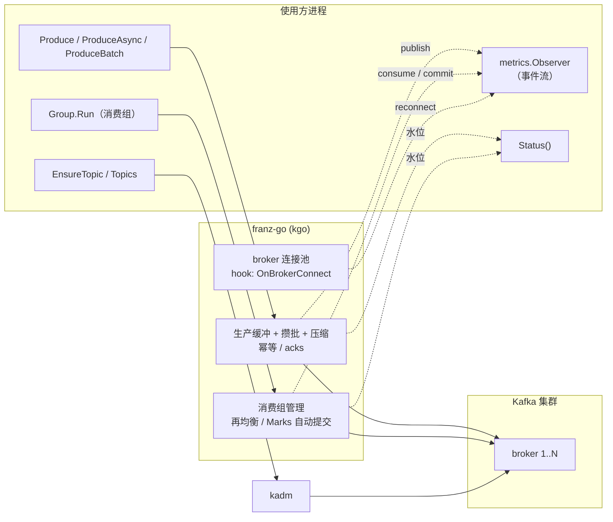

# access/kafka

基于 [franz-go](https://github.com/twmb/franz-go)（`pkg/kgo`）的 Kafka 客户端，拿来即用、默认即生产级。与本仓库其他 `access/*` 包约定一致：非单例、可观测性中立（只抛事件流与状态快照，不依赖 prometheus/otel）、默认值即高可靠。

## 特性

- **默认即可靠**：acks=all、幂等生产（重试不重复）、送达总超时（默认 30s）、"处理完才提交位移"的 Marks 模式。
- **高并发生产**：批量攒发（Linger + BatchMaxBytes）、批压缩（snappy/gzip/lz4/zstd）、有界缓冲背压；`ProduceAsync` 零等待路径、`ProduceBatch` 批内并行送达。
- **高并发消费**：消费组自动再均衡；`Concurrency` 把 handler 撑到任意并发度，位移提交按"每分区连续已处理"推进，不会跳过未处理消息。
- **主题管理**：`Config.Topics` 启动期幂等声明；`EnsureTopic` / `DeleteTopic` / `Topics` 运行期管理。
- **可观测性**：`Observer` 事件流（publish/consume/commit/reconnect/ping）+ `Status()` 缓冲水位快照；`classifyErr` 把 Kafka 协议错误归入低基数原因。`prometheus/` 适配包已接入（事件直方图/错误计数 + 水位 Gauge）。
- **安全**：TLS（含自签 CA）+ SASL（plain / scram-sha-256 / scram-sha-512）。
- **懒连接**：`Open` 不触网，进程启动不因 Kafka 未就绪而卡死。

## 架构



一个 `Client` = 一个生产端连接 + 主题管理；每个消费组（`NewGroup`）**独占**一个新的底层客户端（franz-go 的要求），Close 时一并回收。

## 安装

```bash
go get github.com/zavierswong/go-infra/access/kafka
```

## 快速开始

### 生产

```go
cli, err := kafka.Open(kafka.Config{
    Brokers: []string{"127.0.0.1:9092"},
    Name:    "order", // 指标实例名，多实例部署必填
    Topics: []kafka.TopicSpec{ // 启动时幂等创建
        {Topic: "order.created", Partitions: 3, ReplicationFactor: 3},
    },
})
if err != nil { log.Fatal(err) }
defer cli.Close()

// 同步投递：broker 确认（acks=all）后才返回
err = cli.Produce(ctx, "order.created", body,
    kafka.WithKey([]byte(orderID)), // 同键同分区，分区内有序
)
```

### 消费

```go
err = cli.RunGroup(ctx, kafka.GroupConfig{
    Group:       "notify-sender",
    Topics:      []string{"order.created"},
    Concurrency: 8,          // 并发处理；>1 丢分区内顺序，保序请保持 1
    Handler: func(ctx context.Context, rec *kgo.Record) error {
        return handle(ctx, rec) // 返回 error → 不标记位移 → 之后重投
    },
})
```

### 高吞吐

```go
cli, _ := kafka.Open(kafka.Config{
    Brokers: []string{"127.0.0.1:9092"},
    Linger:  10 * time.Millisecond, // 攒批窗口，请求数与压缩率双收益
})

// 异步：立即返回，确认走 promise（IO 协程里回调，勿阻塞）
cli.ProduceAsync(ctx, "page.view", body, func(r *kgo.Record, err error) {
    if err != nil { log.Printf("投递失败: %v", err) }
}, kafka.WithKey([]byte("u-42")))

// 批量：全部确认后返回；批内并行送达，整批只产生 1 个 publish 事件
err := cli.ProduceBatch(ctx, "page.view", bodies)
```

### metrics 接入

```go
cfg := kafka.Config{
    // ...
    Observer: metrics.ObserverFunc(func(e metrics.Event) {
        // Component=kafka，Instance=Config.Name
        // Op ∈ {publish, consume, commit, reconnect, ping, declare}
    }),
}
```

| Op | 事件 | 说明 |
|---|---|---|
| `publish` | 每次投递 | `ProduceBatch` 整批 1 个事件 |
| `consume` | 每条记录处理完成 | Detail = `topic[p]@offset`（不含消息体） |
| `commit` | 每次位移提交 | 失败 = 重启后重复消费 |
| `reconnect` | broker 建连失败 | 成功建连不上报 |
| `ping` | HealthCheck | 做业务曲线时请过滤 |

`Status()` 快照适合 Gauge（`Group.Status()` 同形，只看 Fetch 侧）：

| 字段 | 含义 |
|---|---|
| `ProduceBufferedRecords` | 未确认记录数；**持续逼近 MaxBufferedRecords = 背压/集群异常的最早信号** |
| `ProduceBufferedBytes` | 生产缓冲字节量 |
| `FetchBufferedRecords` / `FetchBufferedBytes` | 已拉取待消费的记录数/字节量 |

映射到 Prometheus 用 `prometheus.RegisterKafkaStatus`，详见 `prometheus/README.md`；
消费组来源的 Instance 建议带组名后缀（如 `"events-consumer"`），避免与生产端序列混叠。

## 配置参考

### Config（客户端 / 生产者）

| 字段 | 默认 | 说明 |
|---|---|---|
| `Brokers` | 必填 | seed 地址，`host` 省略端口按 9092 |
| `ClientID` | `go-infra-kafka` | 协议层客户端标识 |
| `Name` | — | **指标实例名**，多实例必填 |
| `Observer` | — | 事件观察者 |
| `TLS.Enable` / `CAFile` … | 关 | TLS（配 SASL 时建议开启，PLAIN 明文传密码） |
| `SASL.Mechanism` | 空 | `plain` / `scram-sha-256` / `scram-sha-512` |
| `Acks` | `all` | `one`：leader 宕机可能丢；`none`：最快但会丢 |
| `DisableIdempotence` | `false` | 幂等默认开启；关掉后重试可能重复 |
| `Compression` | `snappy` | gzip / lz4 / zstd / none |
| `Linger` | `0` | 攒批窗口，典型 5~20ms |
| `BatchMaxBytes` | 1MB | 单批上限（对齐 broker `message.max.bytes`） |
| `MaxBufferedRecords` | 10000 | 未确认记录上限；**满了会阻塞（背压）** |
| `DeliveryTimeout` | 30s | 单条记录送达总超时（含全部重试）；负值不限时 |
| `DialTimeout` | 10s | 单次建连超时 |
| `Topics` | — | 启动期幂等声明的主题 |

### TopicSpec

| 字段 | 默认 | 说明 |
|---|---|---|
| `Topic` | 必填 | 主题名 |
| `Partitions` | 3 | 分区数 = 单主题并行度上限，只增不减 |
| `ReplicationFactor` | 1 | 生产建议 3（配合 acks=all） |
| `Configs` | — | 如 `{"retention.ms": "86400000"}` |

### GroupConfig（消费组）

| 字段 | 默认 | 说明 |
|---|---|---|
| `Group` / `Topics` / `Handler` | 必填 | 消费组名 / 订阅主题 / 处理函数 |
| `Concurrency` | 1 | **>1 不保证分区内顺序**；提交按连续已处理推进，不会跳消息 |
| `InstanceID` | 空 | 静态成员：滚动重启不触发全组再均衡 |
| `FromOldest` | `false` | 新组（无已提交位移）从头消费；已有位移不受影响 |
| `DisableAutoCommit` | `false` | 关闭后用 `Group.CommitSync` 手动提交（对齐外部事务） |
| `CommitInterval` | 5s | 自动提交间隔；越长重复消费窗口越大 |
| `MaxPollRecords` | 100 | 单次拉取派发上限；×Concurrency = 在途内存上限 |
| `StopOnHandlerError` | `false` | handler 失败即让 Run 返回该错误 |
| `OnError` | 记日志 | 消费运行错误回调（并发调用，需线程安全） |
| `DrainTimeout` | 30s | 停止时等待在途处理的上限 |

## API 参考

| 方法 | 说明 |
|---|---|
| `Open(Config) (*Client, error)` | 创建客户端（懒连接）+ 幂等声明 Topics |
| `Produce(ctx, topic, body, opts...) error` | 同步投递，等 broker 确认 |
| `ProduceAsync(ctx, topic, body, promise, opts...) error` | 异步投递 |
| `ProduceBatch(ctx, topic, bodies, opts...) error` | 批量投递，等全部确认 |
| `RunGroup(ctx, GroupConfig) error` | 阻塞运行消费组 |
| `NewGroup(GroupConfig) (*Group, error)` + `Run/Close/CommitSync` | 独立生命周期 |
| `EnsureTopic / DeleteTopic / Topics` | 主题管理 |
| `HealthCheck(ctx) error` | 探活（Ping，不占生产缓冲） |
| `Status() Status` | 瞬时水位快照（Client 侧看 Produce 水位） |
| `Group.Status() Status` | 消费组水位快照（只看 Fetch 水位；Closed = Run 已退出） |
| `Close() error` | 关闭（幂等） |

`Produce` 选项：`WithKey`（保序依据）、`WithHeaders`、`WithPartition`（慎用）、`WithTimestamp`。

## 注意事项（含已知缺陷）

1. **ctx 只约束"入队前"**：记录一旦进入发送缓冲，ctx 取消不会中断投递（幂等生产的取消会造成重复，franz-go 默认禁止）。需要放弃未确认记录时靠 `DeliveryTimeout`。`Produce`/`ProduceBatch` 在 ctx 取消时返回 `ctx.Err()`，但该记录**可能仍然送达**（at-least-once，消费方按 Key/内容幂等）。
2. **`Concurrency > 1` 丢分区内顺序**。Kafka 的顺序保证止于"分区内"；保序需求保持 1 并用 `WithKey` 把同类消息哈希进同一分区。
3. **at-least-once 是消费默认语义**：handler 失败不标记位移，提交点停在失败记录之前，重启/再均衡后重投。处理逻辑必须幂等。
4. **一个消费组独占一个底层客户端**（franz-go 的建议），`NewGroup` 会按父配置另建连接；消费组数量多时注意连接数。
5. **`ProduceBatch` 对单条失败返回 errors.Join 聚合错误**，不区分哪一条失败；需要 per-record 结果请用 `ProduceAsync` 的 promise。
6. **已存在主题不会校验属性**：`EnsureTopic` / `Config.Topics` 对已存在的主题直接跳过，"同名但分区/副本不同"不会报错也不会被修正（Kafka 不允许修改副本数），需要显式迁移。
7. **未实现事务生产**（`TransactionalID`）：`DisableAutoCommit + CommitSync` 可覆盖"读-处理-写-提交"的常见场景，但跨主题事务性 exactly-once 暂未封装。
8. **prometheus 适配层已接入**：事件（publish/consume/commit/reconnect/ping）经 `Config.Observer` 自动流入直方图与错误计数；缓冲水位经 `prometheus.RegisterKafkaStatus` 注册成 `go_infra_kafka_buffered_*` Gauge。消费组的 fetch 水位要用 `Group.Status()` 单独注册（它在独立的底层客户端里，`Client.Status()` 拿不到）。
9. **静态成员的代价**：`InstanceID` 离线超过 SessionTimeout 仍被踢出并触发再均衡；扩缩容实例后旧 InstanceID 会占着分区。
10. **未识别的 kerr 错误会归为 unknown**：`ReasonUnknown` 计数持续增长时去日志里找具体错误码。

## 日志

使用全局 `logger`（前缀 `Kafka`）：Open/Close、主题创建、消费组启动为 Info；拉取失败、handler 失败、最终提交失败为 Error（优先回调 `OnError`）。事件流（`Observer`）与日志是两条通道，后者适合人看，前者适合指标。

## 测试

```bash
# 单元测试（不需要 Kafka）
go test ./access/kafka/ -race -count=1

# 集成测试（需要真实 Kafka；未设置环境变量时自动跳过）
docker run -d --name kafka -p 9092:9092 \
  -e KAFKA_NODE_ID=1 \
  -e KAFKA_PROCESS_ROLES=broker,controller \
  -e KAFKA_LISTENERS=PLAINTEXT://:9092,CONTROLLER://:9093 \
  -e KAFKA_ADVERTISED_LISTENERS=PLAINTEXT://127.0.0.1:9092 \
  -e KAFKA_CONTROLLER_LISTENER_NAMES=CONTROLLER \
  -e KAFKA_CONTROLLER_QUORUM_VOTERS=1@127.0.0.1:9093 \
  -e KAFKA_OFFSETS_TOPIC_REPLICATION_FACTOR=1 \
  apache/kafka:latest

KAFKA_TEST_BROKERS=127.0.0.1:9092 go test ./access/kafka/ -race -run TestIntegration
```

用法示例为可编译的 `example_test.go`（不带 `// Output:`，`go test` 只编译不执行），保证文档代码不随 API 失效。

## 目录结构

```
access/kafka/
├── kafka.go            # Client：Open/Close/HealthCheck/Status/懒连接/建连 hook
├── config.go           # Config：默认值、校验、SASL/TLS/压缩映射
├── produce.go          # Produce / ProduceAsync / ProduceBatch + 选项
├── consume.go          # Group：消费组、并发 worker pool、位移标记与提交
├── admin.go            # EnsureTopic / DeleteTopic / Topics（kadm）
├── metrics.go          # 事件派发 + classifyErr（kerr → 低基数 Reason）
├── errors.go           # 哨兵错误
├── config_test.go      # 配置默认值/校验、懒连接、Group 默认值、压缩映射
├── kafka_test.go       # classifyErr 表驱动、Close 后行为
├── integration_test.go # KAFKA_TEST_BROKERS 门控的端到端用例
└── example_test.go     # 可编译示例（最小用法/消费组/高吞吐/手动提交/metrics/SASL）
```
