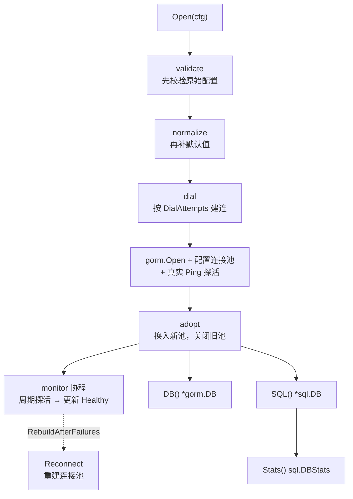
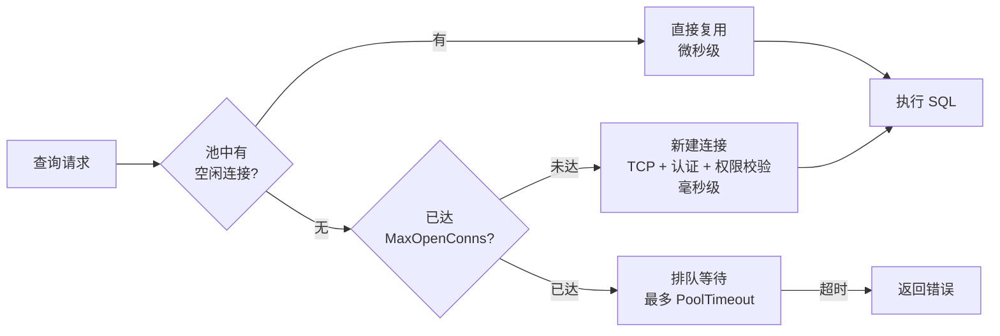

# mysql

`go-infra` 的 MySQL 封装。基于 `gorm.io/driver/mysql` + `gorm.io/gorm`，把**连接池**作为一等公民暴露出来，并提供可信的初始化结果、可控的建连重试与可恢复的关闭。

## 特性

| 能力 | 说明 |
|---|---|
| 连接池显式可调 | `MaxOpenConns` / `MaxIdleConns` / `ConnMaxLifetime` / `ConnMaxIdleTime` 四项全暴露，默认值按 GOMAXPROCS 推导 |
| 可信的初始化 | `gorm.Open` 是懒连接，本包补一次真实 `Ping`，并把 DSN 语法错误提前到启动期 |
| 可控的建连重试 | `DialAttempts` 显式控制尝试次数，**不会像旧版那样永久阻塞** |
| 单一互斥锁 | 一把 `RWMutex` 保护全部可变状态，无数据竞争 |
| 可恢复的关闭 | `Close` 幂等、不死锁、真正关闭连接池；重建时先关旧池，不泄漏 |
| DSN 校验与改写 | 初始化时解析 DSN；`SSL` / 读超时 / 写超时字段**真正生效** |
| 配置单位守卫 | 时长单位写错（旧版是 int 秒/毫秒）会在启动期报错，而不是静默让连接池瘫痪 |
| 连接池监控 | `Stats()` 返回 `sql.DBStats`，可直接接入 Prometheus |
| GORM 日志接入 | SQL 日志 / 慢查询 / 错误经 `go-infra/logger` 输出 |

## 架构



`validate → normalize → dial` 的顺序是有意的：**先校验再补默认值**。反过来的话，负数会在 normalize 阶段被当成"未设置"替换成默认值，非法输入就被静默吞掉了（这是本包开发过程中真实踩过的坑，见 `TestConfigValidate`）。

## 安装

```bash
go get github.com/zavierswong/go-infra/access/mysql
```

## 快速开始

```go
package main

import (
	"context"
	"log"
	"time"

	"github.com/zavierswong/go-infra/access/mysql"
)

func main() {
	m, err := mysql.Open(mysql.Config{
		Dsn: "root:123456@tcp(127.0.0.1:3306)/demo" +
			"?charset=utf8mb4&parseTime=True&loc=Local",

		// 连接池
		MaxOpenConns:    50,
		MaxIdleConns:    50,
		ConnMaxLifetime: 30 * time.Minute,
		ConnMaxIdleTime: 5 * time.Minute,

		LogLevel:      "warn",
		SlowThreshold: 200 * time.Millisecond,
	})
	if err != nil {
		log.Fatalf("连接 MySQL 失败: %v", err)
	}
	defer func() { _ = m.Close() }() // 可重复调用

	ctx := context.Background()

	var count int64
	if err := m.DB().WithContext(ctx).
		Table("orders").
		Where("user_id = ?", 1001).
		Count(&count).Error; err != nil {
		log.Fatal(err)
	}

	// 连接池指标（建议定期上报）
	stats := m.Stats()
	log.Printf("打开=%d 空闲=%d 等待=%d", stats.OpenConnections, stats.Idle, stats.WaitCount)
}
```

## 连接池调优

这是本包的核心价值所在。`database/sql` 的默认值对高并发服务并不友好，而**默认值不当不会报错，只会让 P99 悄悄变差**。

### 一次查询经历了什么



关键点：**新建连接比复用连接慢三个数量级**。而 `database/sql` 的 `MaxIdleConns` 默认只有 **2** —— 意味着 QPS 稍高一点，空闲连接立刻被抢光，之后每个请求都走"新建连接"这条慢路径。

### 四个参数各自的职责

| 参数 | 默认值（本包） | 作用 | 调小的后果 | 调大的后果 |
|---|---|---|---|---|
| `MaxOpenConns` | `GOMAXPROCS × 4`（下限 8） | 并发连接上限 | 请求排队，`WaitCount` 上升 | 服务端线程被压垮 |
| `MaxIdleConns` | `10` | **热连接数量** | 反复拨号，P99 毛刺 | 占用服务端空闲连接 |
| `ConnMaxLifetime` | `30m` | 连接最长寿命 | 频繁重建 | 可能拿到服务端已关闭的坏连接 |
| `ConnMaxIdleTime` | `5m` | 空闲连接回收 | 低频时段连接堆积 | 波峰时重新建连 |

> `go-sql-driver/mysql` 与 `database/sql` 各自的默认值都不太适合生产：`MaxOpenConns` 为 0（不限制）、`MaxIdleConns` 为 2。本包显式给出一组可用默认值，避免"没配也能跑但性能很差"。

### `ConnMaxLifetime` 必须小于 `wait_timeout`

MySQL 默认 `wait_timeout = 28800`（8 小时）。如果客户端把连接留得比这更久，服务端已经单方面关掉了它，客户端还以为有效 —— 表现是偶发的 `invalid connection` / `unexpected EOF`。

```sql
SHOW VARIABLES LIKE 'wait_timeout';   -- 确认服务端设置
```

建议 `ConnMaxLifetime` 取 `wait_timeout` 的 1/4 以内，生产常用 600s~1800s。

### 三种典型场景

```go
// 场景一：Web API，中等并发
mysql.Config{
	MaxOpenConns:    40,              // ≈ CPU 核数 × 4
	MaxIdleConns:    40,              // 与上限一致：波峰时无需临时拨号
	ConnMaxLifetime: 30 * time.Minute,
	ConnMaxIdleTime: 5 * time.Minute,
}

// 场景二：高吞吐批处理 —— 池大、寿命短
mysql.Config{
	MaxOpenConns:    100,
	MaxIdleConns:    20,              // 批处理空闲期长，不必留太多热连接
	ConnMaxLifetime: 10 * time.Minute,
	ConnMaxIdleTime: time.Minute,
}

// 场景三：低频后台任务 —— 小池即可，别占数据库连接
mysql.Config{
	MaxOpenConns:    4,
	MaxIdleConns:    2,
	ConnMaxLifetime: time.Hour,
}
```

### 用 `Stats()` 判断该往哪调

| 指标 | 含义 | 异常时的动作 |
|---|---|---|
| `WaitCount` / `WaitDuration` | 拿不到连接而排队的次数与总时长 | **> 0 就该调大 `MaxOpenConns`** |
| `OpenConnections` | 当前打开的连接数 | 长期贴近 `MaxOpenConns` 说明池子偏小 |
| `InUse` / `Idle` | 使用中 / 空闲的连接数 | `Idle` 长期为 0 说明 `MaxIdleConns` 太小 |
| `MaxIdleClosed` | 因超出空闲上限而被关闭的次数 | 占比高 → 调大 `MaxIdleConns` |
| `MaxLifetimeClosed` | 因寿命到期而被关闭的次数 | 占比高 → `ConnMaxLifetime` 太短 |

> 经验做法：先把 `MaxIdleConns` 设成与 `MaxOpenConns` 相等，消掉"反复拨号"这个最大的噪音源；再根据 `WaitCount` 判断是否需要扩大池子。

### 多实例部署

总连接数 = `实例数 × MaxOpenConns`。部署前先核对服务端容量：

```sql
SHOW VARIABLES LIKE 'max_connections';   -- 默认 151
```

超过之后新连接会被拒绝（`Error 1040: Too many connections`）。留出运维与备份连接的余量，例如 10 个实例 × `MaxOpenConns=40` = 400 < 500。

## 配置参考

| 字段 | mapstructure | 默认 | 说明 |
|---|---|---|---|
| `Dsn` | `dsn` | — | ✅ 必填，见下方格式说明 |
| `MaxIdleConns` | `max_idle_conns` | `10` | **热连接数**，性能关键项 |
| `MaxOpenConns` | `max_open_conns` | `GOMAXPROCS × 4`（≥8） | 并发连接上限 |
| `ConnMaxLifetime` | `conn_max_lifetime` | `30m` | 连接最长寿命，须 < `wait_timeout` |
| `ConnMaxIdleTime` | `conn_max_idle_time` | `5m` | 空闲连接回收时间 |
| `ConnectTimeout` | `connect_timeout` | `5s` | 单次建连超时，写入 DSN 的 `timeout` |
| `DialAttempts` | `dial_attempts` | `3` | 初始化最大尝试次数，负值表示无限 |
| `DialBackoff` | `dial_backoff` | `1s` | 退避起始值 |
| `DialMaxBackoff` | `dial_max_backoff` | `30s` | 退避上限 |
| `HealthCheckInterval` | `health_check_interval` | `30s` | 后台探活间隔 |
| `RebuildAfterFailures` | `rebuild_after_failures` | `0`（不重建） | 连续失败多少次后重建池 |
| `SSL` | `ssl` | — | 对应 DSN 的 `tls`：`true` / `false` / `skip-verify` / `preferred` |
| `ReadTimeout` | `read_timeout` | — | 单条语句读超时 |
| `WriteTimeout` | `write_timeout` | — | 单条语句写超时 |
| `LogLevel` | `log_level` | `info` | `silent` / `error` / `warn` / `info` |
| `SlowThreshold` | `slow_threshold` | `200ms` | 慢 SQL 阈值，负值表示关闭告警 |

`SSL` / `ReadTimeout` / `WriteTimeout` / `ConnectTimeout` 属于**覆盖项**：只在 DSN 里没有对应参数时才写入，不会覆盖你显式写在 DSN 里的取值。

> ⚠️ **时长字段一律使用 `time.Duration`**，配置里必须写带单位的字符串。旧版 `ConnMaxLifetime` / `SlowThreshold` 是 int（分别是秒 / 毫秒），沿用旧写法（如 `conn_max_lifetime: 1800`）会被解析成 1800 纳秒 —— `validate` 会直接报错拦下并提示正确写法，不会静默变成"连接刚建好就过期"。

### DSN 格式

```
user:password@tcp(host:port)/dbname?charset=utf8mb4&parseTime=True&loc=Local
```

| 参数 | 建议 | 作用 |
|---|---|---|
| `charset` | `utf8mb4` | 支持 emoji 与完整 Unicode |
| `parseTime` | `True` | 让 `DATETIME` 映射为 `time.Time`（不设置会扫进 `[]byte`） |
| `loc` | `Local` | 时区，与 `parseTime` 配套 |
| `timeout` | — | 建连超时（也可用 `Config.ConnectTimeout`） |

> DSN 会在初始化阶段被 `go-sql-driver/mysql` 的解析器校验，语法错误或缺少库名都会立刻返回 `ErrInvalidConfig`，而不是等到第一次查询才炸。

### YAML 示例

```yaml
mysql:
  dsn: "root:123456@tcp(127.0.0.1:3306)/app?charset=utf8mb4&parseTime=True&loc=Local"
  max_open_conns: 50
  max_idle_conns: 50
  conn_max_lifetime: 30m
  conn_max_idle_time: 5m
  connect_timeout: 5s
  dial_attempts: 3
  health_check_interval: 30s
  log_level: warn
  slow_threshold: 200ms
```

配合 viper 时字段名与 `mapstructure` tag 一致，可直接反序列化；viper 的默认解码器已包含 `StringToTimeDurationHookFunc`，所以 `30m` 这类字符串能正确解析成 `time.Duration`。

## API 参考

| 方法 | 说明 |
|---|---|
| `Open(cfg) (*MySQL, error)` | 建立连接池并启动健康监控 |
| `(*MySQL).DB() *gorm.DB` | GORM 实例 |
| `(*MySQL).SQL() *sql.DB` | 底层连接池 |
| `(*MySQL).Stats() sql.DBStats` | 连接池统计 |
| `(*MySQL).HealthCheck(ctx) error` | 探活 |
| `(*MySQL).Reconnect() error` | 主动重建连接池 |
| `(*MySQL).Close() error` | 关闭，幂等 |
| `(*MySQL).Closed() bool` | 是否已关闭 |
| `(*MySQL).Healthy() bool` | 最近一次探活结果 |
| `(*MySQL).Config() Config` | 生效后的配置 |

### 错误处理

| 哨兵错误 | 含义 | 该怎么做 |
|---|---|---|
| `ErrInvalidConfig` | 配置非法（DSN、取值、单位） | 启动期问题，改正配置，不要重试 |
| `ErrConnect` | 无法建连或探活失败 | 检查网络、账号、库名；可重试 |
| `ErrClosed` | 客户端已关闭 | 生命周期错误，检查调用顺序 |
| `ErrNotConnected` | 尚未建立连接 | 同上 |

用 `errors.Is` 判定，不要匹配错误文本。

> 注意：`Close()` 之后 `DB()` / `SQL()` 返回 `nil`。请用 `Closed()` 判断，或让 `Close` 与业务停机逻辑对齐（先停止接流量，再关闭）。

### 监控与探活

```go
// 健康检查接口
if err := m.HealthCheck(ctx); err != nil {
	// 返回 503 或触发降级
}

// 定期上报连接池指标
stats := m.Stats()
metrics.Gauge("mysql_open_conns", float64(stats.OpenConnections))
metrics.Gauge("mysql_wait_count", float64(stats.WaitCount))
```

### 关于后台重建

`monitor` 协程默认只做**观测**（更新 `Healthy`、打日志），不会自动重建连接池。原因：`sql.DB` 本身就是连接池，服务端恢复后下一次查询会自动拨号，探活失败通常并不需要重建。

旧版在探活失败后进入无限重连，且重连期间监控循环被阻塞、旧连接池被直接丢弃（泄漏）。如果你确实遇到过"连接池卡死"，可以把 `RebuildAfterFailures` 设为 3 让它在连续失败后走一次 `Reconnect`（先建新池、就绪后再关旧池，期间旧池仍可服务）。

## 从旧版迁移

| 旧行为 | 新行为 |
|---|---|
| `Get` 在 `sync.Once` 里**无限重连**，MySQL 不可达时首个调用方**永久阻塞**且永远拿不到 error | `Open` 有界重试（`DialAttempts`），失败**返回 error** |
| `gorm.Open` 不 Ping 就当成连接成功（配置能解析 = 连接成功） | 补一次真实 `Ping`，初始化结果可信 |
| `m.mu`（写）与包级 `mu`（读）**两把锁**保护同一字段 | 单把 `RWMutex` |
| 重连时直接覆盖字段、**旧连接池永不关闭**（泄漏） | `adopt` 换入新池后关闭旧池 |
| `Close(ctx)` 忽略 ctx 且恒返回 nil；关闭后不可恢复 | `Close()` 无参、幂等、真正关池 |
| `Config.SSL` **零引用**（设了没有任何效果） | 真正写入 DSN 的 `tls` 参数 |
| DSN 语法错误要等到第一次查询才暴露 | 初始化期解析校验 |
| 全局单例，多库/并行测试无法共存 | `Open` 返回实例，由调用方持有 |
| `ConnMaxLifetime` / `SlowThreshold` 是 int（秒 / 毫秒） | 统一 `time.Duration`，且单位写错会被拦下 |

`Get` / `GetDB` / `GetSql` 保留为 `Deprecated` 兼容层，语义与旧版一致（但不再永久阻塞）。

> **唯一的签名变化**：`Close(ctx) error` → `Close() error`。ctx 参数原本就被忽略，去掉后是一个编译期就能发现的改动，不会造成静默行为差异。

## 日志

GORM 的日志接到 `github.com/zavierswong/go-infra/logger`：

| 事件 | 级别 |
|---|---|
| 普通 SQL（`log_level: info` 时） | Info |
| 慢查询（超过 `slow_threshold`） | Warn |
| SQL 执行出错 | Error |
| 建连重试、重建连接池 | Warn / Info |

logger 未 `Init` 时会使用内置默认实例（stdout / info 级别），不影响使用。建议进程入口先 `logger.Init` 再 `mysql.Open`。

> 已知边界：GORM 日志里的 `source` 字段会指向 `logger/gorm.go` 的适配层，而不是业务调用方。这是因为 GORM 不把调用方信息透出给 `Logger` 接口，属于上游能力边界，不是 bug。

## 测试

```bash
# 全部（需要本地 MySQL）
go test ./access/mysql/ -race -count=1 -v

# 只跑纯逻辑用例（不连 MySQL）
go test ./access/mysql/ -race -count=1 -short
```

环境变量：

| 变量 | 默认 |
|---|---|
| `TEST_MYSQL_DSN` | 未设置时按下表拼装 |
| `TEST_MYSQL_DB` | `gointra_test` |

默认连接 `root:123456@tcp(127.0.0.1:3306)/gointra_test`。

**测试卫生**：集成用例使用**专属库名** `gointra_test`（不存在则创建），表名带随机后缀并在 `t.Cleanup` 中删除，不会碰业务库、也不会留下数据。

**跳过策略**：`-short` 跳过集成用例；MySQL **不可达**时跳过（跳过信息写明地址与覆盖方式）；但**创建测试库失败**或**初始化失败**会直接 `t.Fatalf` —— 那说明 MySQL 可达而代码有问题，不该被伪装成绿色。

### 用例覆盖

| 用例 | 覆盖点 |
|---|---|
| `TestConfigNormalize` | 默认值填充、`MaxIdleConns` 截断、退避上限修正 |
| `TestConfigValidate` | DSN 缺失/语法错/缺库名、负值、**单位写错**、非法日志级别 |
| `TestDSNOverrides` | `SSL` / 超时写入 DSN；不覆盖 DSN 中已显式指定的参数 |
| `TestOpenRejectsInvalidConfig` | 非法配置在触网前被拒绝 |
| `TestOpenFailsFastWhenUnreachable` | **旧版 P0 回归**：不可达时快速返回 `ErrConnect`，不永久阻塞 |
| `TestDialAttemptsBounded` | 有限重试的耗时受参数约束 |
| `TestCloseWithoutOpenIsSafe` | 初始化失败时返回 `nil` 实例，不留半可用状态 |
| `TestErrorsAreSentinel` | 四个哨兵错误互不相等、可被 `errors.Is` 判定 |
| `TestOpenAndHealth` | 启动即真实探活；`Healthy` / `Closed` 在生命周期中的取值 |
| `TestPoolSettingsActuallyApplied` | **池参数真的落到 `database/sql` 上** |
| `TestDefaultPoolIsSane` | 默认值不是 `database/sql` 那个 `MaxIdleConns=2` |
| `TestPoolReuseAcrossQueries` | 查询后存在空闲连接供复用 |
| `TestCRUDWithGorm` | 建表 / 写 / 读 / 事务回滚 |
| `TestConcurrentQueries` | 16 协程 × 15 轮，`-race` 下并发 |
| `TestConcurrentHealthAndStats` | 并发读状态（针对旧版双锁） |
| `TestCloseIsIdempotentAndClean` | 重复 Close 不死锁、关闭后状态自洽 |
| `TestReconnect` | 重建后旧池**确实被关闭**（不泄漏） |
| `TestReconnectAfterCloseFails` | 关闭后重建被拒绝 |
| `TestHealthCheckRespectsContext` | ctx 取消时快速返回 |
| `TestLegacyGetStillWorks` | 兼容层可用且单例语义一致 |

另有 `example_test.go`：6 个**可编译**的 `Example`（无 `// Output:`，只编译不执行，不需要 MySQL）。

## 目录结构

```
access/mysql/
├── config.go       # Config + 校验 / 默认值 / DSN 解析与改写
├── errors.go       # 哨兵错误
├── mysql.go        # MySQL 客户端：连接池、探活、重建、关闭
├── legacy.go       # 旧 API 兼容层（Deprecated）
├── config_test.go  # 纯逻辑单元测试（不连 MySQL）
├── mysql_test.go   # 真实 MySQL 集成测试
└── example_test.go # 可编译的用法示例
```
