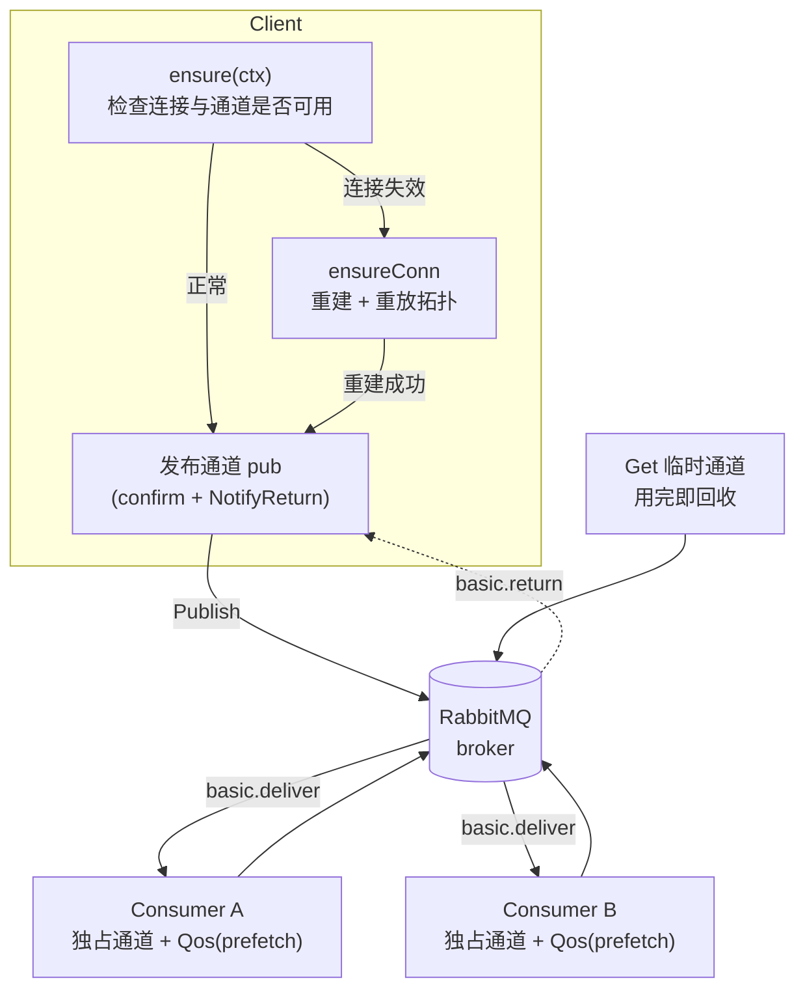
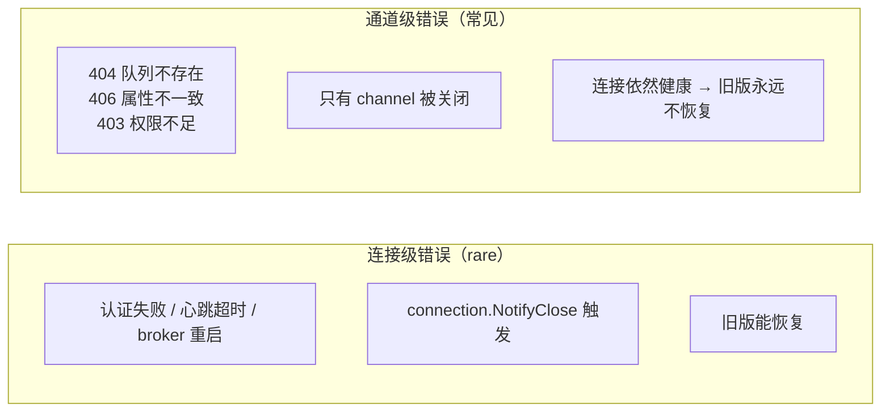
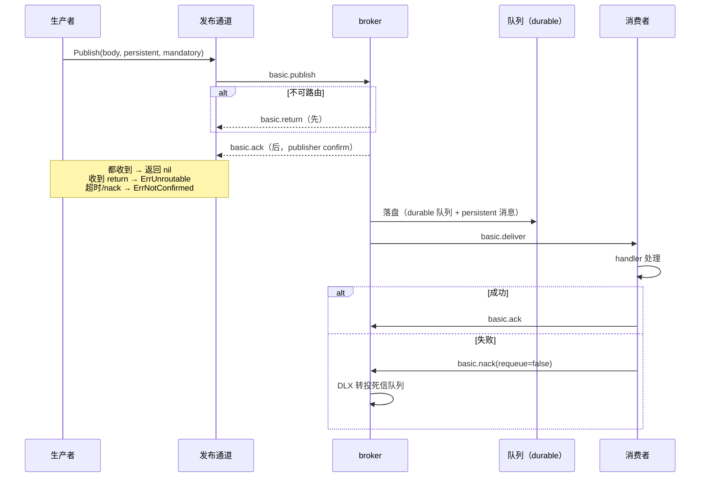
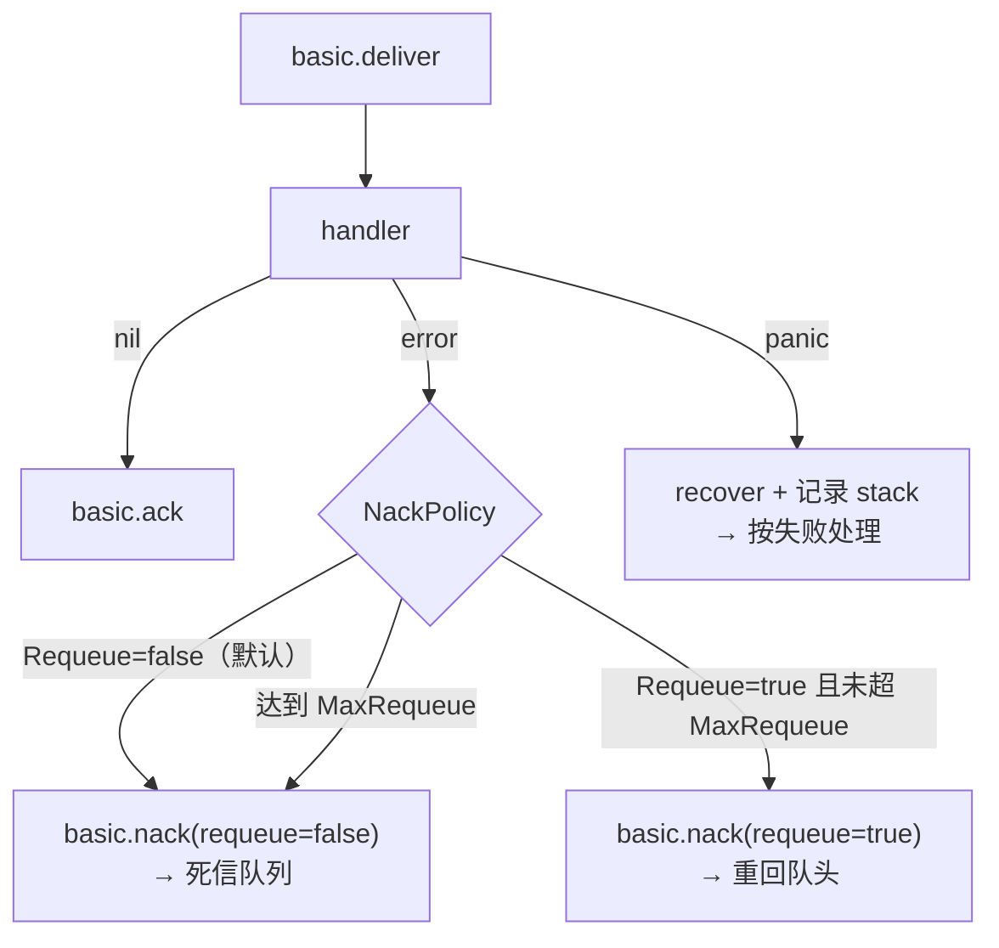
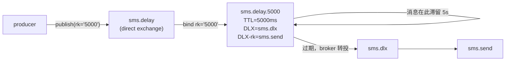

# rabbitmq

`go-infra` 的 RabbitMQ（AMQP 0-9-1）封装。在 `amqp091-go` 之上补齐了**声明式拓扑**、**四种路由模式**、**端到端不丢消息**与**通道级故障自愈**，把容易写错的 AMQP 细节收敛成几个直白的方法。

## 特性

| 能力 | 状态 | 说明 |
|---|---|---|
| 四种路由模式 | ✅ | `direct` / `fanout` / `topic` / `headers` 全部支持，声明式配置 |
| 拓扑声明 | ✅ | 交换机、队列、绑定随连接一并声明，连接重建后自动重放 |
| 持久化 | ✅ | 交换机/队列 `Durable` + 消息 `persistent` 默认开启 |
| Publisher Confirm | ✅ | 发布后等待 broker 确认，返回 `nil` 才代表真的收下 |
| mandatory + basic.return | ✅ | 不可路由的消息显式报错，而非被 broker 静默丢弃 |
| 消费者手动 Ack | ✅ | `handler` 返回 `nil` 自动 Ack，返回 error 按策略 Nack |
| 死信队列（DLX） | ✅ | 提供 `DLXArgs` 参数构造器，失败消息可见、可重放 |
| 延迟消息 | ✅ | 基于 DLX + 队列级 TTL，不需要安装任何插件 |
| 优先级 / quorum / lazy 队列 | ✅ | `PriorityArgs` / `QuorumArgs` / `LazyArgs` / `MaxLengthArgs` |
| 备选交换机 | ✅ | `Exchange.AlternateExchange`，比 mandatory 更可靠 |
| 通道隔离 | ✅ | 生产者共用一条发布通道，每个消费者独享自己的一条 |
| 通道级自愈 | ✅ | 通道被 broker 关闭（404/406）后自动重建并重放拓扑 |
| 多实例 | ✅ | 不再强制单例，多 vhost / 多集群可共存 |
| 同步拉取 | ✅ | `Get` + `Pulled`，适合低频批处理 |
| 优雅停止 | ✅ | `Consumer.Close` 等待在途消息处理完，带超时兜底 |

## 架构



三个关键设计：

1. **通道隔离**：旧版让生产者、所有消费者、`Get` 共用同一条通道 —— 消费者的 `Qos(prefetch)` 会互相覆盖，任何一个消费者把通道关掉会让全体瘫痪。现在生产者独占 `pub`，每个消费者各自 `conn.Channel()`，互不干扰。
2. **懒自愈**：每个操作前先 `ensure()`，只有真的失效才重建，正常路径是零开销的。
3. **穷尽重建**：`ensureConn` 重建后必然重放全部拓扑声明，所以「队列被误删」不会变成永久故障。

### 为什么必须做通道级自愈

这是旧实现最致命的缺陷。AMQP 的错误分两个层级：



`amqp091-go` 在 `channel.go` 里明确写着：*"Errors on methods with this Channel as a receiver means this channel should be discarded and a new channel established."* 旧版只监听 `connection.NotifyClose`，于是遇到 404/406 时连接健康、通知不触发、通道已死，客户端此后每一次调用都失败 —— 相当于**永久瘫痪，只能重启进程**。

现在 `TestChannelFailureSelfHeal` 专门守这个回归：故意制造一个 406（用不同 `durable` 重复声明同名队列），断言「通道被关闭 + 连接仍健康」，再断言「下一次发布自动恢复」。

## 安装

```bash
go get github.com/zavierswong/go-infra/access/rabbitmq
```

依赖 `github.com/rabbitmq/amqp091-go`。

## 快速开始

```go
package main

import (
	"context"
	"fmt"
	"log"
	"time"

	"github.com/zavierswong/go-infra/access/rabbitmq"
)

func main() {
	// 1. 连接 + 声明拓扑（一次搞定）
	cli, err := rabbitmq.Open(rabbitmq.Config{
		Host:     "127.0.0.1",
		Port:     5672,
		VHost:    "app_vhost", // 不带前导 "/"
		Username: "app",
		Password: "123456",

		Exchanges: []rabbitmq.Exchange{
			{Name: "order", Kind: rabbitmq.ExchangeTopic, Durable: true},
		},
		Queues: []rabbitmq.Queue{
			{Name: "order.created", Durable: true},
		},
		Bindings: []rabbitmq.Binding{
			{Queue: "order.created", Exchange: "order", RoutingKey: "order.created.#"},
		},
	})
	if err != nil {
		log.Fatalf("连接 RabbitMQ 失败: %v", err)
	}
	defer cli.Close() // 可重复调用

	ctx := context.Background()

	// 2. 发布（默认持久化 + confirm + mandatory 检测）
	err = cli.Publish(ctx, []byte(`{"id":1}`),
		rabbitmq.ToExchange("order", "order.created.cn"),
		rabbitmq.WithMessageID("order-1"), // 消费方据此做幂等
		rabbitmq.WithMandatory(),          // 不可路由时报错而不是静默丢弃
	)
	if err != nil {
		log.Fatalf("发布失败: %v", err)
	}

	// 3. 消费（自动 Ack / Nack / 优雅停止 / 通道自愈）
	sub, err := cli.NewConsumer(rabbitmq.ConsumerConfig{
		Queue:       "order.created",
		Prefetch:    10,
		Concurrency: 4,
		Handler: func(ctx context.Context, d amqp.Delivery) error {
			fmt.Printf("收到 id=%s body=%s redelivered=%v\n",
				d.MessageId, d.Body, d.Redelivered)
			return nil
		},
	})
	if err != nil {
		log.Fatal(err)
	}
	defer sub.Close()

	// Run 阻塞直到 ctx 取消或 Close 被调用；通道级故障在内部自动恢复
	go sub.Run(ctx)

	time.Sleep(10 * time.Second)
	_ = sub.Close() // 等待在途消息处理完（DrainTimeout 兜底）
}
```

> 上面的 `Handler` 需要 import `amqp "github.com/rabbitmq/amqp091-go"`。

## 四种路由模式

### direct — 精确匹配，点对点

按 routing key 完全相等投递，最常用的是「一个队列一个业务类型」。

```go
cfg := rabbitmq.Config{
	/* ...连接... */
	Exchanges: []rabbitmq.Exchange{
		{Name: "sms", Kind: rabbitmq.ExchangeDirect, Durable: true},
	},
	Queues: []rabbitmq.Queue{
		{Name: "sms.send", Durable: true},
		{Name: "sms.report", Durable: true},
	},
	Bindings: []rabbitmq.Binding{
		{Queue: "sms.send", Exchange: "sms", RoutingKey: "send"},
		{Queue: "sms.report", Exchange: "sms", RoutingKey: "report"},
	},
}
// 发布：routing key 必须完全等于 "send" 或 "report"
cli.Publish(ctx, body, rabbitmq.ToExchange("sms", "send"))
```

> 只投递到单个队列时不必建交换机，`PublishToQueue` 走默认交换机即可：`cli.PublishToQueue(ctx, "sms.send", body)`。

### fanout — 广播，忽略 routing key

消息复制到所有绑定队列，用于「配置刷新 / 缓存失效 / 事件通知」等一对多场景。

```go
cfg := rabbitmq.Config{
	Exchanges: []rabbitmq.Exchange{
		{Name: "config.refresh", Kind: rabbitmq.ExchangeFanout, Durable: true},
	},
	Queues: []rabbitmq.Queue{
		{Name: "config.node.a", Durable: true},
		{Name: "config.node.b", Durable: true},
	},
	Bindings: []rabbitmq.Binding{
		// fanout 的 routing key 必须为空串
		{Queue: "config.node.a", Exchange: "config.refresh"},
		{Queue: "config.node.b", Exchange: "config.refresh"},
	},
}
cli.Publish(ctx, body, rabbitmq.ToExchange("config.refresh", ""))
```

### topic — 通配匹配，按层级分流

routing key 以 `.` 分段，`*` 匹配**恰好一段**，`#` 匹配**零到多段**。一个队列可被多个模式绑定。

```go
cfg := rabbitmq.Config{
	Exchanges: []rabbitmq.Exchange{
		{Name: "order", Kind: rabbitmq.ExchangeTopic, Durable: true},
	},
	Queues: []rabbitmq.Queue{
		{Name: "order.cn.pay", Durable: true},   // 只关心中国区支付
		{Name: "order.all", Durable: true},      // 全量归档
	},
	Bindings: []rabbitmq.Binding{
		{Queue: "order.cn.pay", Exchange: "order", RoutingKey: "order.*.cn.pay"},
		{Queue: "order.all", Exchange: "order", RoutingKey: "order.#"},
	},
}
cli.Publish(ctx, body, rabbitmq.ToExchange("order", "order.created.cn.pay"))
```

| routing key | `order.*.cn.pay` | `order.#` |
|---|---|---|
| `order.created.cn.pay` | ✅ | ✅ |
| `order.refund.cn.pay` | ✅ | ✅ |
| `order.cn.pay` | ❌（`*` 必须占一段） | ✅ |
| `order.created.us.pay` | ❌ | ✅ |

### headers — 按消息头匹配，忽略 routing key

```go
cfg := rabbitmq.Config{
	Exchanges: []rabbitmq.Exchange{
		{Name: "notify", Kind: rabbitmq.ExchangeHeaders, Durable: true},
	},
	Queues: []rabbitmq.Queue{
		{Name: "notify.sms", Durable: true},
		{Name: "notify.email", Durable: true},
	},
	Bindings: []rabbitmq.Binding{
		{
			Queue: "notify.sms", Exchange: "notify",
			Args: amqp.Table{"x-match": "all", "channel": "sms"}, // 全等
		},
		{
			Queue: "notify.email", Exchange: "notify",
			Args: amqp.Table{"x-match": "any", "channel": "email", "priority": "high"}, // 任一满足
		},
	},
}
cli.Publish(ctx, body,
	rabbitmq.ToExchange("notify", ""), // routing key 被忽略
	rabbitmq.WithHeaders(amqp.Table{"channel": "sms", "priority": "high"}),
)
```

> `x-match` **必须**出现在 `Binding.Args` 里（`all` 或 `any`），否则声明会被 broker 拒绝。

## 数据可靠性

### 一条消息的完整生命周期



### 三道防线

| 防线 | 配置 | 防的是什么 |
|---|---|---|
| 持久化 | `Queue.Durable=true` + 默认 `persistent` | broker 重启丢消息（`Transient()` 关掉） |
| Publisher Confirm | `Config.Confirm=true`（默认） | 消息没进 broker 但生产者以为成功了 |
| mandatory | `WithMandatory()` | 消息不可路由，被 broker 静默丢弃 |

**为什么 mandatory 是必需的**：不开它时，向一个不存在的队列或没有匹配绑定的交换机投递，broker 会**直接丢弃**且 `Publish` 返回 `nil`，调用方完全无从感知。开了之后 `Publish` 返回 `ErrUnroutable`。`TestMandatoryVersusSilentDrop` 覆盖了这个对比。

返回值语义：

| 返回值 | 含义 | 调用方应该怎么做 |
|---|---|---|
| `nil` | broker 已确认收下，且未被退回 | 继续 |
| `ErrUnroutable` | 不可路由，消息未进任何队列 | 检查绑定/队列声明，或补发 |
| `ErrNotConfirmed` | broker nack 或确认超时，**可能已丢** | 按业务幂等决定是否重发 |
| `ErrClosed` / `ErrNotConnected` / `ErrPublish` | 链路或客户端状态问题 | 重试或降级 |
| `ErrInvalidConfig` / `ErrTopology` | 配置/声明错误 | 属于启动期问题，别重试 |

用 `errors.Is` 判定，不要匹配错误文本。

### 消费侧的靠性

`handler` 返回 `nil` → 自动 `Ack`；返回 `error` → 按 `NackPolicy` 处置。

```go
sub, _ := cli.NewConsumer(rabbitmq.ConsumerConfig{
	Queue: "order.created",
	// 处理失败的处置策略
	NackPolicy: rabbitmq.NackPolicy{
		Requeue:    false, // 默认 false，交给死信
		MaxRequeue: 3,     // 可选：基于 x-death 计数限制重入队次数
	},
	Handler: func(ctx context.Context, d amqp.Delivery) error {
		return process(d) // 返回 error 即走上面的策略
	},
})
```



> **为什么 `Requeue` 默认 false**：requeue 会把消息放回**队头**，如果失败是确定性的（报文格式错、依赖服务返回 400），就会形成「失败 → 立即重入队 → 立即再失败」的死循环，把一个消费者协程和 CPU 彻底占满。默认送去死信队列，让失败消息**可见、可人工处理**。需要带间隔的重试请用「DLX + 延迟队列」。

### 死信队列

任何队列都可以把「处理失败 / 过期 / 超长被挤出」的消息转投到指定位置：

```go
Queues: []rabbitmq.Queue{
	{
		Name:    "sms.work", // 业务队列
		Durable: true,
		Args: rabbitmq.DLXArgs(rabbitmq.DeadLetter{
			Exchange:   "sms.dlx",  // 为空即默认交换机
			RoutingKey: "sms.dead", // 为空即沿用原 routing key
		}),
	},
	{Name: "sms.dead", Durable: true}, // 死信落地的队列
},
Exchanges: []rabbitmq.Exchange{
	{Name: "sms.dlx", Kind: rabbitmq.ExchangeDirect, Durable: true},
},
Bindings: []rabbitmq.Binding{
	{Queue: "sms.dead", Exchange: "sms.dlx", RoutingKey: "sms.dead"},
},
```

消息进入死信时 broker 会追加 `x-death` 头，本包用它实现 `MaxRequeue`：

```go
msgCount, consumerCount, _ := cli.QueueDepth(ctx, "sms.work") // 积压监控
```

> ⚠️ 踩坑记录：`x-dead-letter-exchange` 必须**始终显式写出**（默认交换机写空串）。只给 `x-dead-letter-routing-key` 而不给 exchange，broker 会直接拒绝声明并报 `PRECONDITION_FAILED ... routing_key_but_no_dlx_defined`。`DLXArgs` 已经处理了这点。

## 延迟消息

用 DLX + 队列级 TTL 实现，**不需要任何插件**。原理：消息先投到一条带 TTL 的队列里「待着」，TTL 到期后由 broker 自动转投到真正的业务队列。



配置（`normalize()` 会自动把延迟拓扑并入 `Exchanges`/`Queues`/`Bindings`）：

```go
cli, _ := rabbitmq.Open(rabbitmq.Config{
	/* ...连接... */
	Delay: &rabbitmq.DelayConfig{
		Prefix: "sms", // → 交换机 "sms.delay"，队列 "sms.delay.5000"
		Delays: []time.Duration{
			5 * time.Second,
			30 * time.Second,
			5 * time.Minute,
		},
		DeadLetter: rabbitmq.DeadLetter{
			Exchange:   "sms.dlx",   // 或留空走默认交换机
			RoutingKey: "sms.send",  // 目标队列名
		},
	},
})
```

投递：

```go
// 明确指定延迟
cli.PublishDelay(ctx, body, 30*time.Second, rabbitmq.ToQueue("sms.send"))

// 或用选项（等价）
cli.Publish(ctx, body,
	rabbitmq.ToQueue("sms.send"),
	rabbitmq.WithDelay(30*time.Second),
)
```

> **档位必须预先声明**。TTL 是队列级参数，改它就等于改队列属性，所以只能支持离散的延迟值。请求一个未声明的档位时，消息会被延迟交换机丢弃（配合 `WithMandatory()` 可以拿到明确报错）。
>
> 需要**任意**延迟请部署 `rabbitmq_delayed_message_exchange` 插件，然后用普通 `Publish`。

> 顺带说明旧版的坑：旧版用**消息级** TTL 假装延迟。实测下来有消费者时消息 **4ms** 就到，没有消费者时消息在 TTL 到期后被**直接丢弃** —— 既不延迟，又会丢消息。而且消息级 TTL 只在「到达队头」时才检查，队列里混用不同 TTL 会出现队头阻塞。

## 消费者

### 并发处理

```go
sub, _ := cli.NewConsumer(rabbitmq.ConsumerConfig{
	Queue:       "order.created",
	Prefetch:    10, // 每条通道独立生效，不会与别的消费者互相覆盖
	Concurrency: 4,  // >1 时同一队列并发处理，不再保证顺序
	Handler:     handle,
})
```

| `Concurrency` | 语义 |
|---|---|
| `0` / `1` | 串行处理，**严格保序** |
| `>1` | 并发处理，**不再保序**，handler 必须幂等 |

### 优雅停止

```go
go sub.Run(ctx)

// ... 收到 SIGTERM ...

sub.Close() // 1. 取消消费者  2. 等在途消息处理完  3. 最多等 DrainTimeout
```

`DrainTimeout`（默认 30s）到期后本包放弃等待并返回，避免一个卡住的 handler 让进程永远退不出去。`TestConsumerGracefulStop` 验证了「停止后不再收到新消息，在途消息仍被处理完」。

### 错误回调

```go
sub, _ := cli.NewConsumer(rabbitmq.ConsumerConfig{
	Queue: "order.created",
	OnError: func(err error) {
		metrics.ConsumerError.Inc() // 会被多个协程并发调用，需线程安全且不能阻塞
	},
	Handler: handle,
})
```

`OnError` 会收到：注册失败、Ack/Nack 失败、handler 返回的错误、handler panic。

### 保活

```go
sub.Run(ctx) // 通道级故障在内部自动恢复：重建通道 → 重设 Qos → 重新注册
```

`TestConsumerSurvivesMissingQueue` 验证了「消费者启动时队列还不存在，等队列被创建后能自动接上」。

## 同步拉取

`Get` 是「拉」模型，由调用方控制节奏，适合低频、批处理。它与 `Consume` 的推模型互补。

```go
p, ok, err := cli.Get(ctx, "sms.send", false) // autoAck=false
if err != nil {
	return err
}
if !ok {
	return nil // 队列当前为空
}
defer p.Close() // 必须：释放本次拉取占用的通道

if err := process(p.Body()); err != nil {
	return p.Nack(true) // 重新入队
}
return p.Ack()
```

> ⚠️ `Pulled` 持有它那条临时通道的所有权。**必须**先 `Ack`/`Nack`、再 `Close` —— 通道一旦释放，确认就无处可发（会得到 `504 channel/connection is not open`）。这也是本包把它设计成一个显式类型而不是 `(amqp.Delivery, error)` 的原因。
>
> 相比 `Consume`，`Get` 每条消息都新建/销毁一条通道，只适合低频场景。

## 连接与自愈

```go
cli.HealthCheck(ctx) // 探活接口，验证当前能否取得可用连接
cli.Closed()         // 是否已关闭
cli.Config()         // 生效后的配置（已补默认值、已展开延迟拓扑）
```

首次建连由 `DialAttempts` 控制，不会像旧版那样无限阻塞在初始化里：

| `DialAttempts` | 行为 |
|---|---|
| `0` | 默认 4 次 |
| `1` | 失败即返回（测试用，问题立刻暴露） |
| 负值 | 无限重试直到客户端被 `Close` |

重试间隔按 `DialBackoff`（默认 1s）指数退避到 `DialMaxBackoff`（默认 30s）。

## 配置参考

### 连接

| 字段 | mapstructure | 默认 | 说明 |
|---|---|---|---|
| `Host` | `host` | — | 必填 |
| `Port` | `port` | — | 必填 |
| `VHost` | `vhost` | `/` | 建议**不带**前导 `/`（如 `app_vhost`） |
| `Username` | `username` | — | 必填 |
| `Password` | `password` | — | 必填，含 `/` `:` `@` 等特殊字符会被正确转义 |
| `Tls.Enable` | `tls.enable` | `false` | 开启后走 `amqps://` |
| `Tls.InsecureSkipVerify` | `tls.insecure_skip_verify` | `false` | 跳过证书校验（仅测试用） |
| `Tls.ServerName` | `tls.server_name` | — | SNI |
| `Tls.CAFile` | `tls.ca_file` | — | PEM 根证书；为空用系统信任链 |
| `Heartbeat` | `heartbeat` | `10s` | 心跳间隔 |
| `ConnectTimeout` | `connect_timeout` | `10s` | 单次建连超时 |
| `DialAttempts` | `dial_attempts` | `4` | 首次建连最大尝试次数，负值无限 |
| `DialBackoff` | `dial_backoff` | `1s` | 退避起始值 |
| `DialMaxBackoff` | `dial_max_backoff` | `30s` | 退避上限 |

### 行为

| 字段 | mapstructure | 默认 | 说明 |
|---|---|---|---|
| `Confirm` | `confirm` | `true` | 生产通道开启 publisher confirm |
| `ConfirmTimeout` | `confirm_timeout` | `5s` | 等待 broker 确认的超时 |
| `ReturnWindow` | `return_window` | `100ms` | mandatory 发布后等待 `basic.return` 的窗口，负值表示不等 |
| `Prefetch` | `prefetch` | `1` | 消费者默认 QoS 预取条数 |

> `ReturnWindow` 为什么不是 0：broker 对不可路由的消息是**先**发 `basic.return`、**再**回 confirm ack，但本进程把 return 从库的缓冲通道派发给调用方需要一次调度，所以无法完全零窗口地同步判定。该窗口只在调用方显式开启 `mandatory` 时生效；不介意漏判就用 `SetReturnHandler` 注册异步回调。

### 拓扑

```yaml
rabbitmq:
  host: 127.0.0.1
  port: 5672
  vhost: app_vhost
  username: app
  password: "123456"
  confirm: true
  prefetch: 10
  exchanges:
    - name: order
      kind: topic
      durable: true
      alternate_exchange: order.unroutable
  queues:
    - name: order.created
      durable: true
  bindings:
    - queue: order.created
      exchange: order
      routing_key: "order.created.#"
  delay:
    prefix: sms
    delays: [5s, 30s, 5m]
    dead_letter:
      exchange: ""
      routing_key: sms.send
```

> `Delays` 是 `[]time.Duration`，从 YAML 的字符串（`5s`）解码需要 duration hook。用 viper 时其默认解码器已包含 `StringToTimeDurationHookFunc`，可直接这样写；若直接用 `mapstructure` 解码，需自行 `DecodeHook(mapstructure.StringToTimeDurationHookFunc())`。
>
> 所有配置结构（含嵌套的 `TLSConfig` / `DeadLetter` / `DelayConfig`）都带 `mapstructure` tag，并有 `TestConfigStructsHaveMapstructureTags` 用反射守住 —— 新增字段漏写 tag 会让该字段在配置文件里静默失效，这条用例专门拦这种情况。

| 字段 | mapstructure | 说明 |
|---|---|---|
| `Exchanges[].Name` | `name` | 交换机名 |
| `Exchanges[].Kind` | `kind` | `direct`（默认）/ `fanout` / `topic` / `headers` |
| `Exchanges[].Durable` | `durable` | 持久化，生产环境应为 `true` |
| `Exchanges[].AutoDelete` | `auto_delete` | 无绑定时自动删除 |
| `Exchanges[].Internal` | `internal` | 内部交换机，只能被其他交换机转发 |
| `Exchanges[].AlternateExchange` | `alternate_exchange` | 兜底交换机，比 mandatory 更可靠（不依赖生产者在线） |
| `Queues[].Args` | `args` | 见下面的参数构造器 |
| `Bindings[].Args` | `args` | headers 交换机需要，须含 `x-match` |
| `Delay.Prefix` | `prefix` | 拓扑名前缀 |
| `Delay.ExchangeKind` | `exchange_kind` | 默认 `direct`（推荐，避免同档位被多队列重复消费） |
| `Delay.Delays` | `delays` | 延迟档位 |
| `Delay.DeadLetter` | `dead_letter` | 到期后的去向 |

### 队列参数构造器

| 构造器 | 作用 |
|---|---|
| `DLXArgs(DeadLetter)` | 死信转发（`x-dead-letter-exchange` / `x-dead-letter-routing-key`） |
| `MessageTTLArgs(ttl)` | 队列级消息存活时间，超时走死信 |
| `MaxLengthArgs(n)` | 限制队列长度，超出按 `x-overflow` 策略（默认 `drop-head`） |
| `QuorumArgs()` | quorum 队列（Raft 复制），数据安全性优于已废弃的 classic mirror；需 `Durable=true` 且非 `Exclusive` |
| `PriorityArgs(max)` | 优先级队列，`max` 取 1..255 |
| `LazyArgs()` | lazy 队列，消息尽量不驻留内存 |

多个参数可以合并（`amqp.Table` 就是 `map[string]any`，直接遍历合并即可）：

```go
args := rabbitmq.MaxLengthArgs(100000)
for k, v := range rabbitmq.DLXArgs(rabbitmq.DeadLetter{RoutingKey: "order.overflow"}) {
	args[k] = v
}

rabbitmq.Queue{Name: "order.bulk", Durable: true, Args: args}
```

## PublishOption 参考

所有选项都是可选叠加的。

| 选项 | 作用 |
|---|---|
| `ToQueue(q)` | 投递到队列（默认交换机），最常用的点对点写法 |
| `ToExchange(ex, rk)` | 投递到指定交换机的指定 routing key（路由模式的入口） |
| `WithMandatory()` | 不可路由时返回 `ErrUnroutable` 而不是静默丢弃 |
| `Transient()` | 标记非持久化（默认持久化） |
| `WithContentType(ct)` | 默认 `application/json` |
| `WithDelay(d)` | 延迟投递，依赖 `Config.Delay` |
| `WithMessageID(id)` | 消息 ID，消费方据此做幂等 |
| `WithCorrelationID(id)` | 关联 ID，RPC 风格调用用它串起请求与响应 |
| `WithReplyTo(q)` | 回复地址 |
| `WithType(t)` | 业务消息类型，便于消费方按类型分发 |
| `WithAppID(id)` | 来源应用标识 |
| `WithHeaders(table)` | 自定义 headers（headers 交换机的路由依据） |
| `WithPriority(p)` | 消息优先级，需目标队列声明了 `x-max-priority` |
| `WithExpiration(d)` | 消息级 TTL，到期未消费会被丢弃或走死信 |

> `WithExpiration` 属于**消息级** TTL，只在消息到达队头时才被检查，队列里混用不同 TTL 会有队头阻塞。需要精确延迟用 `PublishDelay`。

### 退回消息的异步回调

```go
cli.SetReturnHandler(func(r amqp.Return) {
	logger.Warnf(context.Background(),
		"消息被退回: rk=%s reply=%s(%d) body=%s",
		r.RoutingKey, r.ReplyText, r.ReplyCode, r.Body)
})
```

与 `Publish` 的同步判定互补：同步判定受 `ReturnWindow` 限制可能漏判，回调**不会漏**，但它在库的派发协程里执行，不能阻塞太久。

## 从旧版迁移

旧 API（`Get` / `RabbitMQ` / `Publish(queue, body, delay)` / `StartConsumer`）保留为 `Deprecated` 兼容层，但**语义已被修正**：

| 旧行为 | 新行为 |
|---|---|
| `Get` 在 `sync.Once` 里无限重连，首个调用方**永久阻塞** | `Open` 返回 error，重试次数由 `DialAttempts` 控制 |
| 全局单例，多 vhost / 并行测试互相污染 | 多实例，`Open` 返回的 `*Client` 由调用方持有 |
| 所有角色共享一条通道，`Qos` 互相覆盖 | 生产者 / 每个消费者 / `Get` 各自独占通道 |
| 只监听连接级 `NotifyClose`，通道级故障**永久瘫痪** | 连接级 + 通道级双重自愈 |
| `Close()` 持锁 `return ch.Close()` → 死锁；且连接泄漏 | 幂等、无死锁、连接与通道都被关闭 |
| VHost 直接字符串拼接 → `prod` 变成 `...:5672prod` | `net/url` 正确组装，特殊字符自动转义 |
| `delay > 0` 用消息级 TTL 假装延迟，**既不延迟又丢消息** | 走真实延迟拓扑；`Config.Delay` 未声明时**返回 error** |
| 不可路由的消息被静默丢弃，`Publish` 返回 `nil` | 默认开启 confirm；开启 mandatory 后返回 `ErrUnroutable` |
| 消费只拿到裸 `[]byte`，无法做幂等 | `Handler` 拿到完整 `amqp.Delivery` |
| `Exchange.AutoDelete` / `Queue.Exclusive` 字段空转 | 全部真实生效 |
| 无 `NotWait` 跳过了服务端确认（保留的反模式） | 已移除 |

新代码请直接用 `Open`。

## 测试

测试分两层，都是**真实 broker 集成测试**，不是 mock：

```bash
# 全部（需要本地 RabbitMQ）
go test ./access/rabbitmq/ -race -count=1 -v

# 只跑纯逻辑用例（不连 broker）
go test ./access/rabbitmq/ -race -count=1 -short

# CI 上建议
go test ./access/rabbitmq/ -race -count=1
```

环境变量（都有本地默认值）：

| 变量 | 默认 |
|---|---|
| `TEST_RABBITMQ_HOST` | `127.0.0.1` |
| `TEST_RABBITMQ_PORT` | `5672` |
| `TEST_RABBITMQ_VHOST` | `app_vhost` |
| `TEST_RABBITMQ_USER` | `app` |
| `TEST_RABBITMQ_PASS` | `123456` |

**跳过策略**：`-short` 跳过全部集成用例；broker **连不上**时跳过（跳过信息里写明地址与如何覆盖）；但如果是**拓扑声明失败**——那说明 broker 可达而代码有问题——用例会 `t.Fatalf` 直接失败。

> 这个区分是刻意做的。早期版本把「拓扑声明失败」也当成环境问题 `t.Skip`，结果 `TestNackGoesToDeadLetter` 因为 `DLXArgs` 少写了一个参数而**被跳过**，整套用例却是绿的 —— 那就是典型的「假绿」，比测试少更危险。

### 用例覆盖

全部 22 个用例，跑一遍大约 5.5s：

| 用例 | 覆盖点 |
|---|---|
| `TestDirectRouting` | direct 精确匹配 |
| `TestFanoutBroadcast` | fanout 广播到多个队列 |
| `TestTopicRouting` | topic 的 `*` / `#` 通配（含不匹配的负例） |
| `TestHeadersRouting` | headers 的 `x-match: all` 与 `any` |
| `TestMandatoryVersusSilentDrop` | mandatory 报错 vs 默认静默丢弃 |
| `TestPublishConfirmBrokerAccepted` | confirm 正常路径返回 nil |
| `TestNackGoesToDeadLetter` | nack(requeue=false) 进死信队列 |
| `TestDelayMessage` | 延迟消息在约定时间后到达 |
| `TestDelayWithoutConfigRejected` | 未声明 `Config.Delay` 时 `WithDelay` 报错而非丢消息 |
| `TestChannelFailureSelfHeal` | **最重要的回归**：406 关通道、连接仍健康、下次发布自愈 |
| `TestConsumerSurvivesMissingQueue` | 队列后创建，消费者自动接上 |
| `TestCloseIdempotentAndNoDeadlock` | `Close` 可重复调用、不死锁 |
| `TestConcurrentPublishAndConsume` | 4 生产者 × 25 消息 + 3 并发消费者，断言无重复无丢失（`-race` 下） |
| `TestGetSyncPull` | `Pulled` 的 Ack / Nack / Close 生命周期 |
| `TestConsumerGracefulStop` | 优雅停止：不再收新消息，在途消息处理完 |
| `TestAmqpURI` | DSN 拼接（含 `vhost=prod`、密码含 `/` `:`） |
| `TestConfigValidate` | 12 组非法配置 |
| `TestConfigNormalize` | 默认值填充 + 延迟拓扑展开 |
| `TestPublishOptionValidation` | 发布选项校验 |
| `TestDelayRoutingKey` | 延迟档位 → routing key 映射 |
| `TestQueueArgsBuilders` | 各参数构造器的输出 |

**测试卫生**：每次运行用随机 `testRunID` 生成独立拓扑名（`gointra.test.<runID>.*`），用例结束通过 `t.Cleanup` 删除自己创建的队列与交换机，可以安全地对着开发环境的 broker 反复跑，不会互相干扰、不留垃圾。

### 可编译的用法示例

本目录还有一份 `example_test.go`，把上面各章节的用法写成了 Go 的 `Example` 函数。它们**没有** `// Output:` 注释，所以 `go test` 只做编译检查、不真正执行 —— 既不需要 broker 在跑，又能保证文档里的代码不会随 API 演进而悄悄失效。

覆盖：`Example`（完整流程）、`ExampleToQueue`、`ExampleToExchange_direct` / `_fanout` / `_topic` / `_headers`、`ExampleClient_Publish_mandatory`、`ExampleClient_PublishDelay`、`ExampleClient_NewConsumer`、`ExampleClient_Get`、`ExampleClient_SetReturnHandler`、`ExampleClient_HealthCheck`、`ExampleDLXArgs`、`ExampleQuorumArgs`、`ExampleQueue_args`、`ExampleDelayConfig_Topology`。

## 目录结构

```
access/rabbitmq/
├── config.go        # Config / Exchange / Queue / Binding / DelayConfig + 参数构造器
├── errors.go        # 哨兵错误
├── client.go        # Client：连接、通道管理、拓扑声明、懒自愈
├── publish.go       # 可靠发布：confirm / mandatory / 退回关联 / 延迟
├── consume.go       # Consumer：独占通道、并发、手动 ack、优雅停止；Get + Pulled
├── rabbitmq.go      # 包文档 + 旧 API 兼容层（Deprecated）
├── config_test.go   # 纯逻辑单元测试（不连 broker）
├── rabbitmq_test.go # 真实 broker 集成测试
└── example_test.go  # 可编译的用法示例
```
