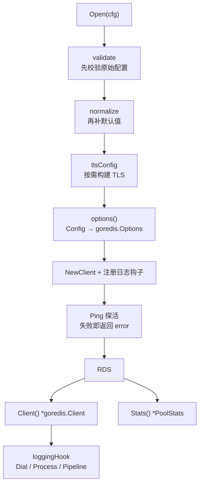
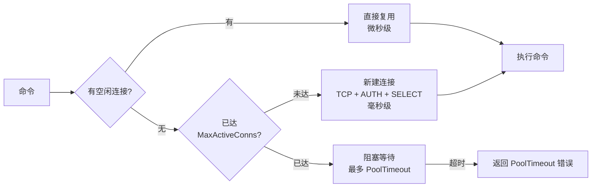

# redis

`go-infra` 的 Redis 封装。基于 `github.com/redis/go-redis/v9`，把**连接池**作为一等公民暴露出来，并修正了重试语义、日志钩子与关闭语义上的几处实质缺陷。

## 特性

| 能力 | 说明 |
|---|---|
| 连接池显式可调 | `PoolSize` / `MinIdleConns` / `MaxIdleConns` / `MaxActiveConns` / `PoolTimeout` / `ConnMaxIdleTime` / `ConnMaxLifetime` 全部暴露 |
| 热连接预热 | `MinIdleConns` 常驻空闲连接，消除流量波峰时的建连延迟 |
| 硬上限保护 | `MaxActiveConns` 是真正的并发上限（注意 `PoolSize` **不是**上限） |
| 重试语义修正 | 默认 3 次重试；`-1` 明确表示禁用（旧版写死 `-1` 却注释成"最大重试次数"） |
| ctx 超时生效 | 默认尊重调用方 ctx 的 deadline（go-redis 原始默认是忽略） |
| 可恢复的关闭 | `Close` 幂等，且关闭后可重新初始化 —— 旧版关闭后无法恢复 |
| 真实可用的日志钩子 | 失败命令 Warn、慢命令告警；`redis.Nil` 正确处理为**非错误** |
| TLS | 支持 `CAFile` / 双向认证 / SNI |
| ACL | 支持 Redis 6+ 的 `Username` |
| 连接池监控 | `Stats()` 返回 `PoolStats`，可直接接入 Prometheus |

## 架构



`Config → Options` 的映射被单独抽成 `options()` 方法，因此可以**在不连 Redis 的情况下逐字段断言**（见 `TestOptionsMapping`）。这不是为了好看：漏传一个字段不会报错，只会让配置静默失效，而那种问题在集成测试里几乎发现不了。

## 安装

```bash
go get github.com/zavierswong/go-infra/access/redis
```

## 快速开始

```go
package main

import (
	"context"
	"errors"
	"log"
	"time"

	goredis "github.com/redis/go-redis/v9"
	infraredis "github.com/zavierswong/go-infra/access/redis"
)

func main() {
	r, err := infraredis.Open(infraredis.Config{
		Addr:     "127.0.0.1:6379",
		Password: "123456",
		DB:       0,

		// 连接池
		PoolSize:       100,              // 基准连接数
		MinIdleConns:   20,               // 常驻热连接，抗住流量波峰
		MaxActiveConns: 200,              // 硬上限
		PoolTimeout:    4 * time.Second,

		ReadTimeout:  3 * time.Second,
		WriteTimeout: 3 * time.Second,
		MaxRetries:   3, // 注意：-1 表示**禁用**重试
	})
	if err != nil {
		log.Fatalf("连接 Redis 失败: %v", err)
	}
	defer func() { _ = r.Close() }() // 可重复调用

	ctx := context.Background()
	client := r.Client() // 之后就是原生 go-redis，无额外抽象

	if err := client.Set(ctx, "user:1001", `{"name":"zavier"}`, 10*time.Minute).Err(); err != nil {
		log.Fatalf("写入失败: %v", err)
	}

	val, err := client.Get(ctx, "user:1001").Result()
	if errors.Is(err, goredis.Nil) {
		log.Println("未命中") // key 不存在是正常业务结果，不是错误
		return
	}
	if err != nil {
		log.Fatal(err)
	}
	log.Println(val)
}
```

> 命名提醒：本包与 go-redis 的包名都叫 `redis`。需要同时引用 `redis.Nil` 这类符号时请给其中一个起别名（如上例的 `goredis` / `infraredis`）。

## 连接池调优

这是本包的核心价值所在。

### 一次命令的取连接路径



与 MySQL 不同的是：Redis 的连接在**空闲时不会被回收**（除非设了 `MinIdleConns` / `MaxIdleConns` / `ConnMaxIdleTime`），所以"反复拨号"更多发生在冷启动与空闲回收之后。

### 参数职责与默认值

| 参数 | 默认值（本包 / go-redis） | 作用 | 备注 |
|---|---|---|---|
| `PoolSize` | `GOMAXPROCS × 10` / 同 | 基准连接数 | ⚠️ **不是硬上限**，池不够时仍会继续新建 |
| `MinIdleConns` | `0` / `0` | **常驻热连接数** | 性能关键项，建议设为 `PoolSize` 的 1/4 ~ 1/2 |
| `MaxIdleConns` | `0`（不限制） / `0` | 空闲连接上限 | 超出部分被关闭 |
| `MaxActiveConns` | `0`（不限制） / `0` | **真正的硬上限** | 多实例部署时建议显式设置 |
| `PoolTimeout` | `ReadTimeout + 1s` / 同 | 池满时的等待上限 | 快速失败通常优于无限排队 |
| `ConnMaxIdleTime` | `30m` / `30m` | 空闲连接回收 | 应小于服务端 `timeout` |
| `ConnMaxLifetime` | **`1h`** / `0`（不过期） | 连接最长寿命 | 本包默认值更安全，见下 |
| `ConnMaxLifetimeJitter` | `ConnMaxLifetime / 10` / `0` | 寿命随机抖动 | 避免连接集体过期造成建连风暴 |
| `MaxRetries` | `3` / `3` | 命令重试次数 | **`-1` 表示禁用** |
| `PoolFIFO` | `false` / `false` | 取连接顺序 | `false`=LIFO（复用最近的连接）；`true`=FIFO（更快回收空闲连接） |

> 为什么本包把 `ConnMaxLifetime` 默认为 `1h`：go-redis 默认 **0，即永不过期**。主从切换、代理重启或云托管实例迁移之后，池中长期存活的连接可能指向已经失效的节点。配合 Jitter 让连接错峰重建，代价很小、收益明确。

### 三个"必须知道"的点

**1. `PoolSize` 不是上限**

go-redis 的文档明确写着：连接不够用时会**继续超额新建**，想真正封顶必须用 `MaxActiveConns`。所以多实例部署时要用 `MaxActiveConns` 来守住服务端容量：

```
实例数 × MaxActiveConns < Redis maxclients   # 默认 10000
```

**2. `MinIdleConns` 是抗毛刺的第一杠杆**

跨可用区、带 TLS、或者中间有代理的连接，一次建连可能就要几毫秒。默认 `MinIdleConns = 0` 意味着流量低谷后连接被回收，下一波请求要先付这笔建连成本，表现为 P99 毛刺。把它设为 `PoolSize` 的 1/4 ~ 1/2 通常就能消掉。

**3. `MaxRetries = -1` 会禁用重试**

这是 go-redis 反直觉的一处设计（`-1` 而不是 `0` 表示禁用），旧版正是被它坑到。本包已有测试 `TestMaxRetriesSemantics` 专门守住这条语义，并在 README 里明确标注。

### 三种典型场景

```go
// 场景一：常规在线服务 —— 预热连接，抗住波峰
infraredis.Config{
	PoolSize:       100,
	MinIdleConns:   25,
	MaxActiveConns: 200,                 // 硬上限
	PoolTimeout:    4 * time.Second,
	ConnMaxIdleTime: 5 * time.Minute,
	ConnMaxLifetime: time.Hour,
}

// 场景二：延迟极度敏感 —— 池开大、热连接留足、快速失败
infraredis.Config{
	PoolSize:     200,
	MinIdleConns: 100,
	PoolTimeout:  100 * time.Millisecond, // 拿不到就立刻失败，交给上层降级
	MaxRetries:   3,
}

// 场景三：低频后台任务 —— 小池、不预热，省连接
infraredis.Config{
	PoolSize:     4,
	MinIdleConns: 0,
	MaxRetries:   1,
}
```

### 用 `Stats()` 判断该往哪调

| 指标 | 含义 | 异常时的动作 |
|---|---|---|
| `Misses` | 需要新建连接的次数 | 持续增长 → 调大 `MinIdleConns` / `PoolSize` |
| `Hits` | 直接命中池的次数 | 占比越高越好 |
| `Timeouts` | 池满而等待超时的次数 | **> 0 → 调大 `MaxActiveConns` 或排查连接泄漏** |
| `TotalConns` / `IdleConns` | 连接总数 / 空闲数 | `IdleConns` 长期为 0 说明池太紧 |
| `StaleConns` | 因过期被回收的连接数 | 占比高 → `ConnMaxIdleTime` / `ConnMaxLifetime` 太短 |

## 配置参考

| 字段 | mapstructure | 默认 | 说明 |
|---|---|---|---|
| `Addr` | `addr` | — | ✅ 必填，`host:port` |
| `Username` | `username` | — | Redis 6+ ACL 用户名 |
| `Password` | `password` | — | 密码 |
| `DB` | `db` | `0` | 库编号，**集群模式下必须为 0** |
| `ClientName` | `client_name` | — | `CLIENT SETNAME`，便于在服务端分辨来源 |
| `Protocol` | `protocol` | `0`（RESP3） | `2` / `3`，老服务端用 2 |
| `PoolSize` | `pool_size` | `GOMAXPROCS × 10` | 基准连接数（非上限） |
| `MinIdleConns` | `min_idle_conns` | `0` | 常驻热连接数，**推荐调项** |
| `MaxIdleConns` | `max_idle_conns` | `0` | 空闲连接上限，0 表示不限制 |
| `MaxActiveConns` | `max_active_conns` | `0` | 硬上限，0 表示不限制 |
| `PoolTimeout` | `pool_timeout` | `ReadTimeout + 1s` | 池满时等待上限 |
| `PoolFIFO` | `pool_fifo` | `false` | 取连接顺序 |
| `ConnMaxIdleTime` | `conn_max_idle_time` | `30m` | 空闲回收，`-1` 关闭检查 |
| `ConnMaxLifetime` | `conn_max_lifetime` | `1h` | 最长寿命，负值表示不过期 |
| `ConnMaxLifetimeJitter` | `conn_max_lifetime_jitter` | `Lifetime / 10` | 寿命抖动 |
| `DialTimeout` | `dial_timeout` | `5s` | 建连超时 |
| `ReadTimeout` | `read_timeout` | `3s` | 读超时，`-1` 不超时 / `-2` 不设 deadline |
| `WriteTimeout` | `write_timeout` | `3s` | 写超时 |
| `DisableContextTimeout` | `disable_context_timeout` | `false` | 为 true 时不尊重 ctx 的 deadline |
| `MaxRetries` | `max_retries` | `3` | 重试次数，**`-1` 表示禁用** |
| `MinRetryBackoff` | `min_retry_backoff` | `8ms` | 最小退避，`-1` 禁用退避 |
| `MaxRetryBackoff` | `max_retry_backoff` | `512ms` | 最大退避 |
| `TLS.Enable` | `tls.enable` | `false` | 开启 TLS |
| `TLS.CAFile` | `tls.ca_file` | — | PEM 根证书，留空用系统信任链 |
| `TLS.CertFile` / `TLS.KeyFile` | `tls.cert_file` / `tls.key_file` | — | 双向认证，必须成对提供 |
| `TLS.ServerName` | `tls.server_name` | — | SNI，留空则从 `Addr` 推导 |
| `TLS.InsecureSkipVerify` | `tls.insecure_skip_verify` | `false` | 跳过证书校验，仅测试用 |
| `LogSlowThreshold` | `log_slow_threshold` | `0`（关闭） | 超过该阈值的命令记为 Warn |
| `LogCommands` | `log_commands` | `false` | 记录每条命令（Debug），仅排查用 |

> ⚠️ **时长字段一律使用 `time.Duration`**，配置里必须写带单位的字符串。把毫秒整数直接写进来（如 `read_timeout: 3000`）会被解析成 3000 纳秒 —— `validate` 会直接报错拦下并提示正确写法。
>
> 负值是**有意义的**（`ReadTimeout: -1` 表示不超时、`MaxRetries: -1` 表示禁用重试、`ConnMaxLifetime` 负值表示不过期），所以单位哨兵只检查**正的极小值**，不会误伤这些语义。

### 关于 `DisableContextTimeout` 的命名

它的默认值必须是"尊重 ctx 超时"，但 Go 的 `bool` 零值是 `false`。如果命名成正向的 `ContextTimeout bool` 并声称"默认开启"，实现里就必然要额外把它设成 `true` —— 一旦漏掉，注释与实现就相反了（本包第一版正是这么错的，被 `TestConfigNormalize` 抓了出来）。

所以这里采用标准库 `DisableKeepAlives` / `InsecureSkipVerify` 的命名思路：**让零值就是期望的默认行为**。

### YAML 示例

```yaml
redis:
  addr: 127.0.0.1:6379
  username: app
  password: "123456"
  db: 0
  client_name: order-svc
  pool_size: 100
  min_idle_conns: 25
  max_active_conns: 200
  pool_timeout: 4s
  conn_max_idle_time: 5m
  conn_max_lifetime: 1h
  dial_timeout: 5s
  read_timeout: 3s
  write_timeout: 3s
  max_retries: 3
  min_retry_backoff: 8ms
  max_retry_backoff: 512ms
  log_slow_threshold: 10ms
  tls:
    enable: false
```

配合 viper 时字段名与 `mapstructure` tag 一致，可直接反序列化。

## API 参考

| 方法 | 说明 |
|---|---|
| `Open(cfg) (*RDS, error)` | 创建客户端并验证连通性 |
| `(*RDS).Client() *goredis.Client` | 原生 go-redis 客户端 |
| `(*RDS).Stats() *goredis.PoolStats` | 连接池统计 |
| `(*RDS).HealthCheck(ctx) error` | 探活 |
| `(*RDS).Close() error` | 关闭，幂等 |
| `(*RDS).Closed() bool` | 是否已关闭 |
| `(*RDS).Config() Config` | 生效后的配置 |

> 本包只负责**生命周期与连接池**，不逐个转发 go-redis 的命令。业务命令通过 `Client()` 直接调用原生客户端 —— 这样既不会被封装限制能力，也不需要跟着 go-redis 的版本升级反复补方法。

### 错误处理

| 哨兵错误 | 含义 | 该怎么做 |
|---|---|---|
| `ErrInvalidConfig` | 配置非法（Addr、取值、单位、TLS） | 启动期问题，改正配置 |
| `ErrConnect` | 无法连接或探活失败 | 检查网络、认证、TLS；可重试 |
| `ErrClosed` | 客户端已关闭 | 检查生命周期调用顺序 |
| `ErrNotConnected` | 尚未建立连接 | 同上 |

用 `errors.Is` 判定。业务层判断"key 不存在"请用 `errors.Is(err, goredis.Nil)` —— 本包不会把它当成错误记日志。

### 日志钩子

| 事件 | 级别 |
|---|---|
| 命令失败（除 `goredis.Nil`） | Warn |
| 慢命令（超过 `LogSlowThreshold`） | Warn |
| 每条命令（`LogCommands: true`） | Debug |
| 建连成功 / 失败 | Debug |

两点设计说明：

1. **`goredis.Nil` 不记为错误**。缓存未命中是最常见的正常路径，记成错误会让告警完全失效 —— 这是 Redis 封装里很常见的错误。
2. **建连日志用 Debug**。go-redis 的拨号器内部本身有重试，一次失败的 `Open` 会触发十余次 DialHook；每次都打 Warn 只会淹没日志（go-redis 自己也会输出一条拨号失败警告）。建连失败的真正原因由上层命令的错误暴露。
3. **不开启日志时几乎零成本**。旧版 `ProcessPipelineHook` 会无条件分配一个 `[]string` 并逐条调 `Name()`，却从不使用（那段逻辑被注释掉了）。现在只在确实要输出日志时才去拼命令名。

## 从旧版迁移

| 旧行为 | 新行为 |
|---|---|
| `MaxRetries: -1` —— 注释写"最大重试次数"，实际是**禁用重试**，连带退避参数全部空转 | 默认 `3` 次；`-1` 的含义在字段注释、README 与测试里三处写清 |
| 配置只有 5 个字段，池参数、超时、重试全部硬编码 | 全部可配，并给出合理默认值 |
| 缺少 `MinIdleConns` → 低谷后连接被回收，波峰时重新建连 | `MinIdleConns` 可配，`TestMinIdleConnsKeepsConnectionsWarm` 守着预热效果 |
| `PoolSize` 被当成并发上限 | 文档明确 `PoolSize` 不是上限，需要硬上限请用 `MaxActiveConns` |
| `Get(cfg)` 在初始化失败时 `panic` | 新 API 用 `Open` 返回 error；`Get` 保留但已 `Deprecated` 并标注 panic 行为 |
| `Get` 不持锁读全局变量（TOCTOU 竞态） | 实例由调用方持有，`RDS.mu` 保护，读写一致 |
| `Close()` 不重置全局变量 → 关闭后 `Get` 返回**已关闭**的 client，且 `New` 因"已存在"返回 nil，**进程无法恢复** | `Close` 幂等；兼容层 `Close` 会重置全局实例，之后可重新 `New` |
| 三个 hook 全是空实现（函数体被注释掉） | 实现失败命令 Warn + 慢命令告警，且 `redis.Nil` 不算错误 |
| `ProcessPipelineHook` 每条 pipeline 白分配一个切片 | 按需构建，关闭日志时零分配 |
| 无 TLS、无 ACL 用户名、无 `ClientName` | 全部支持 |
| `reconnect()` 只是在一个循环里反复 `Ping` 同一个客户端（go-redis 本就自动重连） | 移除。连接健康由 go-redis 连接池与 `HealthCheck` 负责 |

`New` / `Get` / `Close` 保留为 `Deprecated` 兼容层，语义尽量与旧版一致（除了 `Close` 后可恢复这一处改进）。

## 测试

```bash
# 全部（需要本地 Redis）
go test ./access/redis/ -race -count=1 -v

# 只跑纯逻辑用例（不连 Redis）
go test ./access/redis/ -race -count=1 -short
```

环境变量：

| 变量 | 默认 |
|---|---|
| `TEST_REDIS_ADDR` | `127.0.0.1:6379` |
| `TEST_REDIS_PASSWORD` | `123456` |
| `TEST_REDIS_DB` | `0` |

**测试卫生**：每次运行的 key 都带随机前缀（`gointra:test:<纳秒>:*`），用例结束在 `t.Cleanup` 中删除，可以安全地对着开发环境的 Redis 反复跑。

**跳过策略**：`-short` 跳过集成用例；**TCP 不可达**时跳过（跳过信息写明地址与覆盖方式）；但认证失败、命令报错会直接 `t.Fatalf` —— 那说明 Redis 可达而代码有问题。

### 用例覆盖

| 用例 | 覆盖点 |
|---|---|
| `TestConfigNormalize` | 默认值、`PoolSize` 与 `MaxActiveConns` 的关系、`MinIdleConns` 截断、Jitter |
| `TestMaxRetriesSemantics` | **核心回归**：`0→3`、`-1` 保留为"禁用"、`<-1` 被拒绝 |
| `TestOptionsMapping` | **逐字段**断言 `Config → goredis.Options`，防止配置静默失效 |
| `TestConfigValidate` | Addr 缺失、各类负值、`Protocol` 非法、**单位写错**、TLS 证书不成对 |
| `TestTLSConfigBuild` | TLS 组装、SNI 推导、CA 文件缺失与内容非法 |
| `TestIsRealErr` | `goredis.Nil`（含包装后）不被视为错误 |
| `TestOpenRejectsInvalidConfig` | 非法配置在触网前被拒绝 |
| `TestOpenFailsFastWhenUnreachable` | 不可达时快速返回 `ErrConnect` |
| `TestErrorsAreSentinel` | 四个哨兵错误互不相等、可被 `errors.Is` 判定 |
| `TestOpenAndHealth` | 启动即真实探活 |
| `TestPoolSettingsActuallyApplied` | 池参数与非默认项真的落到 `Options()` 上 |
| `TestPoolStatsAvailable` | 池统计可用 |
| `TestMinIdleConnsKeepsConnectionsWarm` | **预热效果**：并发后空闲连接不为 0 |
| `TestNilIsNotAnError` | 未命中返回 `goredis.Nil`，不是其他错误 |
| `TestPipelineUsesHook` | 走通 pipeline 路径 |
| `TestTTLAndExpire` | 键生命周期 |
| `TestConcurrentCommands` | 16 协程 × 20 轮读写，`-race` 下并发 |
| `TestCloseIsIdempotentAndClean` | 重复 Close；关闭后各接口返回明确结果 |
| `TestHealthCheckRespectsContext` | ctx 取消时快速返回 |
| `TestLegacyNewGetCloseWorks` | 兼容层，且 Close 后可重新初始化 |

另有 `example_test.go`：7 个**可编译**的 `Example`（无 `// Output:`，只编译不执行，不需要 Redis）。

## 目录结构

```
access/redis/
├── config.go       # Config / TLSConfig + 校验 / 默认值 / TLS 构建
├── errors.go       # 哨兵错误
├── redis.go        # RDS 客户端 + 日志钩子
├── legacy.go       # 旧 API 兼容层（Deprecated）
├── config_test.go  # 纯逻辑单元测试（不连 Redis）
├── redis_test.go   # 真实 Redis 集成测试
└── example_test.go # 可编译的用法示例
```
