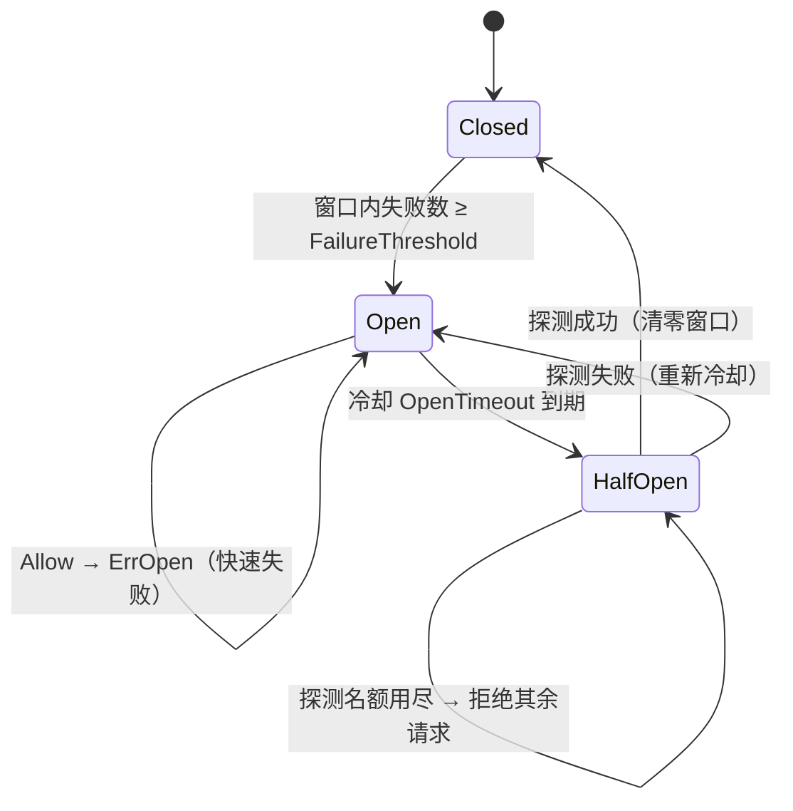

# breaker

三态熔断器（Closed / Open / HalfOpen）：下游持续失败时快速拒绝请求，
把故障挡在门外；冷却后放行少量探测，确认恢复再全量放行。

零外部依赖（纯标准库），所有方法并发安全。

## 特性

- **滑动窗口计数**：窗口内失败数达阈值即熔断。刻意不用「连续失败数」——
  偶发成功会清零连续计数，下游持续劣化时熔断器永远不开。
- **半开限量探测**：冷却到期只放行 `HalfOpenMaxProbes` 个探测请求，
  探测成功回 Closed、失败回 Open 重新冷却。
- **惰性状态推进**：`State()` 在冷却到期后直接返回 HalfOpen，
  监控读值不滞后一个请求周期。
- **快速失败语义**：`ErrOpen` 用 `errors.Is` 判断，调用方走降级而不是重试。

## 架构



## 安装

```bash
go get github.com/zavierswong/go-infra/breaker
```

## 快速开始

```go
b := breaker.New(breaker.Config{
	Name:              "payment",
	FailureThreshold:  5, // 窗口内 5 次失败即熔断
	Window:            0, // 零值取默认 1m
	OpenTimeout:       0, // 零值取默认 30s
	HalfOpenMaxProbes: 1, // 半开只放 1 个探测
})

err := b.Do(func() error { return callPayment() })
if errors.Is(err, breaker.ErrOpen) {
	return fallback() // 熔断中：走降级，不要重试
}
```

可编译的完整示例见 `example_test.go`。

## 配置参考

| 字段 | 默认值 | 说明 |
|---|---|---|
| `Name` | `""` | 实例名，用于日志与未来指标标签 |
| `Window` | `1m` | 滑动窗口长度（分 10 个桶滚动） |
| `FailureThreshold` | `5` | 窗口内失败数阈值。用绝对数而非失败率：窗口刚起步时失败率无统计意义 |
| `OpenTimeout` | `30s` | 熔断冷却时长，到期转 HalfOpen |
| `HalfOpenMaxProbes` | `1` | 半开状态的并发探测名额。调大恢复更快，但下游压力更大 |

## API 参考

| 方法 | 说明 |
|---|---|
| `New(cfg Config) *Breaker` | 创建，零值配置字段取默认值 |
| `Allow() error` | 是否放行；`ErrOpen` 表示熔断中 |
| `Record(err error)` | 上报一次调用结果。**Allow 放行的调用必须 Record**，否则半开探测名额泄漏 |
| `Do(fn func() error) error` | Allow + fn + Record 组合，拒绝时 fn 不执行 |
| `DoContext(ctx, fn)` | 先尊重 ctx 取消再走 Do |
| `State() State` | 当前状态（惰性推进后） |
| `Name() string` | 实例名 |

## 注意事项

- **放行必须配对 Record。** 直接用 `Allow/Record` 时漏掉 Record 会让
  半开探测名额无法回收；拿不准就用 `Do` / `DoContext`。
- **熔断器只看结果，不看耗时。** 慢调用本身不触发熔断 —— 请在调用侧
  自行设置超时，让超时变成失败结果进入窗口。
- **`ErrOpen` 不要重试。** 重试只会延长 Open 状态；正确的反应是降级。
- **多实例进程内存态。** 熔断状态不跨进程共享，每个实例各自熔断 ——
  对"保护下游"的语义通常正确，也避免了共享状态的额外延迟。
- **窗口分桶为 10。** 计数粒度为 `Window/10`，对阈值量级（个位数~百）
  足够平滑。

## 日志

本包不产生日志，状态变化通过 `State()` 轮询或未来接入 `metrics.Observer` 暴露。

## 测试

```bash
go test ./breaker/... -race -count=1
```

覆盖：阈值熔断、成功不熔断、冷却转半开、探测限量、探测成败两分支、
窗口过期遗忘旧失败、Do/DoContext 组合、并发竞态。

## 目录结构

```
breaker/
├── breaker.go        状态机 + 滑动窗口实现
├── breaker_test.go   单元测试
├── example_test.go   可编译用法示例
└── README.md
```
