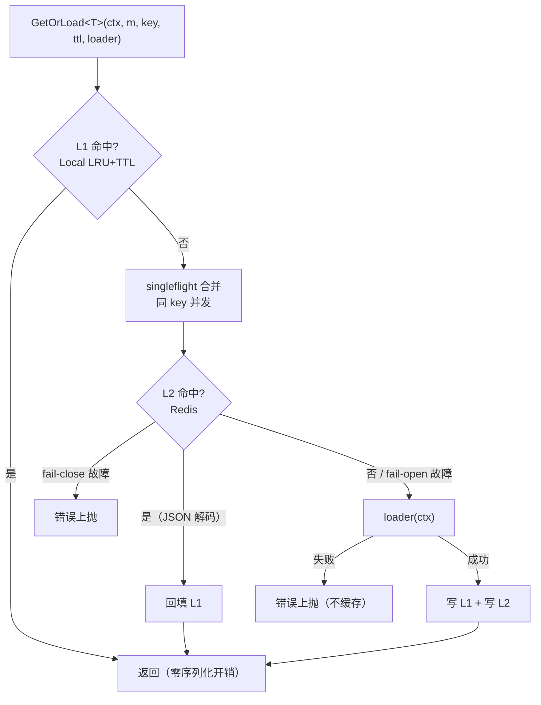

# cache

进程内本地缓存与「本地 L1 + Redis L2」两级缓存。L1 零序列化开销、L2 跨实例共享，
`GetOrLoad` 泛型加载内置 singleflight 合并并发加载，防缓存击穿。

## 特性

- **Local（L1）**：零外部依赖的 LRU + TTL 缓存，并发安全，可选后台过期清理协程
- **Redis（L2）**：原始字节薄封装，key 统一前缀隔离，可复用 `access/redis` 连接
- **Multi（两级组合）**：L1 命中 → L2 命中回填 → loader 加载回写两级，全程一次调用
- **防击穿**：singleflight 合并同 key 并发加载，热点过期瞬间 loader 至多执行一次
- **泛型 API**：`GetOrLoad[T]` 编译期类型安全，L1 存原值、L2 走 JSON 编解码
- **故障策略可选**：L2 读故障默认 fail-open（降级为未命中，可用性优先），可切 fail-close
- **脏数据自愈**：L2 反序列化失败当作未命中，由 loader 重新加载覆盖
- **可观测**：`Stats()` 暴露 L1/L2 命中、真实加载、L2 故障、回写计数

## 架构



## 安装

```bash
go get github.com/zavierswong/go-infra/cache
```

## 快速开始

```go
package main

import (
	"context"
	"log/slog"
	"os"
	"time"

	"github.com/redis/go-redis/v9"

	"github.com/zavierswong/go-infra/cache"
)

type UserProfile struct {
	ID   int64
	Name string
}

func main() {
	// 也可复用 access/redis 的底层连接。
	cli := redis.NewClient(&redis.Options{Addr: "127.0.0.1:6379"})

	m := cache.NewMulti(cli, cache.MultiConfig{
		Local: cache.LocalConfig{
			Size:            10_000,          // LRU 容量
			TTL:             30 * time.Second, // L1 过期（短，弱化跨实例不一致窗口）
			CleanupInterval: time.Minute,      // 后台清理；0 = 纯惰性删除
		},
		Redis: cache.RedisConfig{
			KeyPrefix: "myapp:cache:", // 建议必填，隔离命名空间
		},
		FailClosed: false, // Redis 故障时当作未命中
		Logger:     slog.New(slog.NewTextHandler(os.Stderr, nil)),
	})
	defer m.Close()

	ctx := context.Background()

	// 读路径：L1 → L2 → loader（并发下 loader 至多执行一次）。
	user, err := cache.GetOrLoad(ctx, m, "user:42", 5*time.Minute,
		func(ctx context.Context) (*UserProfile, error) {
			return loadUserProfileFromDB(ctx, 42)
		})
	if err != nil {
		panic(err)
	}
	_ = user

	// 数据更新后主动失效两级。
	_ = m.Invalidate(ctx, "user:42")

	// 只刷新本机 L1（L2 被外部更新时）。
	m.InvalidateLocal("user:42")
}

func loadUserProfileFromDB(ctx context.Context, id int64) (*UserProfile, error) {
	return &UserProfile{ID: id, Name: "example"}, nil
}
```

只用本地缓存时，直接使用 `Local`：

```go
l := cache.NewLocal(cache.LocalConfig{Size: 1000, TTL: time.Minute})
defer l.Close()
l.Set("k", "v")
v, ok := l.Get("k")
```

## 配置参考

### LocalConfig（L1）

| 字段 | 默认 | 说明 |
|---|---|---|
| `Size` | 0（不限） | LRU 容量（最大条目数），超限淘汰最久未使用条目 |
| `TTL` | 0（不过期） | 条目存活时间，读取时惰性判断 |
| `CleanupInterval` | 0（不启动） | 后台过期清理周期；0 时仅靠读取惰性删除 |

### RedisConfig（L2）

| 字段 | 默认 | 说明 |
|---|---|---|
| `KeyPrefix` | `""` | key 统一前缀，多应用共享 Redis 时必填 |
| `TTL` | 0 | `Set` 未显式给 ttl 时的默认过期时间 |

### MultiConfig（两级）

| 字段 | 默认 | 说明 |
|---|---|---|
| `Local` | — | L1 配置，同上 |
| `Redis` | — | L2 配置，同上 |
| `FailClosed` | `false` | L2 读故障策略：false 降级为未命中（fail-open）；true 返回错误（fail-close） |
| `Logger` | `nil` | 记录 L2 降级 / 写失败 / 反序列化失败，nil 静默 |

## API

| 方法 | 说明 |
|---|---|
| `NewLocal(LocalConfig) *Local` | 创建 L1（CleanupInterval>0 启动后台清理） |
| `Local.Get(key) (any, bool)` | 读取（命中移动到 LRU 头部；过期等价不存在） |
| `Local.Set(key, val any)` | 写入（超限淘汰尾部） |
| `Local.Delete(key)` | 删除 |
| `Local.Len() / Hits() / Misses()` | 条目数与命中统计 |
| `Local.Close()` | 停止后台清理协程（幂等） |
| `NewRedis(cli, RedisConfig) *Redis` | 创建 L2 适配器 |
| `Redis.Get(ctx, key) ([]byte, bool, error)` | 读原始字节（错误原样上抛） |
| `Redis.Set(ctx, key, val, ttl) error` | 写原始字节 |
| `Redis.Delete(ctx, keys...) error` | 删除 |
| `NewMulti(cli, MultiConfig) *Multi` | 创建两级缓存 |
| `GetOrLoad[T](ctx, m, key, ttl, loader) (T, error)` | 包级泛型读加载（singleflight 防击穿） |
| `Multi.Invalidate(ctx, key) error` | 两级同时失效 |
| `Multi.InvalidateLocal(key)` | 仅失效本机 L1 |
| `Multi.Stats() Stats` | L1Hits / L2Hits / Loads / L2Errors / L2Writes |
| `Multi.Close()` | 停止 L1 后台清理（幂等） |

## 注意事项

- **L1 与 L2 的过期不同步**：L2 回填 L1 后，L1 副本按 `Local.TTL`（而非传入 `GetOrLoad` 的 ttl）独立过期。跨实例一致性要求高的 key，请把 `Local.TTL` 设得远小于 L2 ttl，或依赖更新方主动 `Invalidate`。
- **Invalidate 只作用于执行它的实例**：其他实例的 L1 副本不受影响，这是两级缓存的固有取舍（广播失效属上层职责，本包不实现）。
- **loader 错误不缓存**：失败的 key 下次请求会重新加载；如需「负缓存」请在上层显式实现。
- **值类型要求**：L2 走 JSON 编解码，`T` 需可 JSON 序列化；含 channel/func/循环引用的类型不适用（L1-only 的 `Local` 无此限制）。
- **singleflight 只合并单进程并发**：跨实例同时击穿时，各实例 loader 各执行一次——db 层仍可能承受 N 实例次回源，极端热点可配合更长的 L2 ttl 弱化。
- **fail-open 的语义**：L2 故障被降级为未命中并计入 `Stats.L2Errors`，请求不会失败，但流量会瞬时压到 loader（db）上，请确保 loader 能扛。
- **cleanupLoop 是 O(n) 遍历**：大容量 + 高频清理会占用 CPU，一般 `Size ≤ 10^5` 且 `CleanupInterval ≥ 1min` 即可。

## 测试

```bash
go test ./cache/ -race -count=1
```

单测基于 miniredis，覆盖：LRU 淘汰顺序、TTL 过期、并发读写（-race）、
两级命中回填、singleflight 合并、失效、loader 错误不缓存、
fail-open / fail-close、脏数据自愈。

## 目录结构

```
cache/
├── local.go        # L1：LRU + TTL 本地缓存（零依赖）
├── redis.go        # L2：Redis 字节值适配器
├── multi.go        # 两级组合 + singleflight + 泛型 GetOrLoad
├── cache_test.go   # 单测（miniredis）
└── example_test.go # 可编译示例
```
