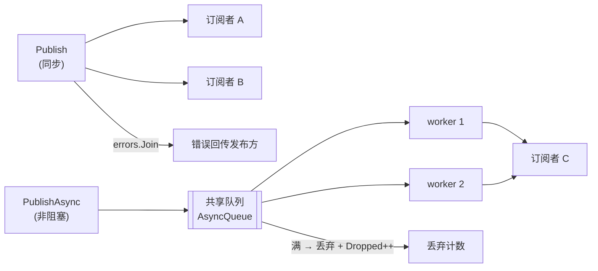

# eventbus

进程内事件总线（pub/sub），风格与 `metrics.Event` 的观察者模式一致：
发布方只管广播，订阅方按 topic 消费。

## 特性

- **同步 / 异步两种派发**：`Publish` 在调用方 goroutine 执行订阅者并汇总
  错误；`PublishAsync` 进共享队列由 worker 池消费，发完就走。
- **panic 隔离**：单个订阅者 panic 被 recover 成错误，不炸发布方、不炸 worker。
- **背压明确**：异步队列满即丢弃并计数（`Dropped()`）—— 宁可丢通知，
  不让发布方被慢消费者拖死。
- **优雅关闭**：`Close` 排空已入队事件后返回，不丢已发布的消息。
- **零依赖**：纯标准库。

## 架构



## 安装

```bash
go get github.com/zavierswong/go-infra/eventbus
```

## 快速开始

```go
b := eventbus.New(eventbus.Config{Logger: logger.Default()})
defer func() { _ = b.Close(context.Background()) }()

// 订阅：topic 与 payload 类型成对定义在使用方包里。
cancel, _ := b.Subscribe("order.paid", func(ctx context.Context, e eventbus.Event) error {
	o := e.Payload.(orderPaid)
	return sendSms(ctx, o) // 返回的错误会被 Publish 汇总
})
defer cancel()

// 同步发布：全部订阅者执行完才返回，错误 errors.Join 回传。
err := b.Publish(ctx, "order.paid", orderPaid{OrderID: "A1"})

// 异步发布：非阻塞，适合审计 / 埋点类通知。
ok := b.PublishAsync("audit.log", orderPaid{OrderID: "A1"})
```

## 配置参考

| 字段 | 类型 | 默认值 | 说明 |
|---|---|---|---|
| `Logger` | `*slog.Logger` | `slog.Default()` | 异步错误 / panic / 丢弃事件日志；推荐 `logger.Default()` |
| `AsyncWorkers` | `int` | `4` | 异步派发 worker 数 |
| `AsyncQueue` | `int` | `1024` | 异步队列长度；满则丢弃 |

## API 参考

| 符号 | 说明 |
|---|---|
| `New(Config) *Bus` | 构造并启动 worker 池 |
| `(*Bus).Subscribe(topic, Handler) (cancel func(), err error)` | 订阅；cancel 幂等 |
| `(*Bus).Publish(ctx, topic, payload) error` | 同步派发；汇总订阅者错误；无订阅者为 no-op |
| `(*Bus).PublishAsync(topic, payload) bool` | 异步派发；`false` = 队列满或已关闭 |
| `(*Bus).Dropped() uint64` | 丢弃事件总数 |
| `(*Bus).Topics() []string` | 当前有订阅者的 topic（诊断用） |
| `(*Bus).Close(ctx) error` | 停止接收 + 排空队列 + 等 worker；幂等 |
| `ErrClosed` | 关闭后 Publish/Subscribe 返回 |

## 注意事项

- **Payload 是 `any`**：订阅方自行断言类型；建议 topic 常量与 payload
  结构体成对定义、发布/订阅双方共享，断言失败属于编程错误。
- **异步不保证顺序**：多 worker 并发消费，同一 topic 的事件可能乱序；
  有序需求在 Payload 里带序号自行重排。
- **异步错误不可回传**：`PublishAsync` 返回只代表"入队成功"，
  处理错误只写日志 —— 要求结果就闭环就用 `Publish`。
- **丢弃策略是设计取舍**：队列满丢事件不丢请求。关键事件（不能丢）
  请用 `Publish`，或调大 `AsyncQueue` 并监控 `Dropped()`。
- **handler 不要长期阻塞**：同步 handler 卡住会卡住发布方，
  异步 handler 卡满 worker 会把队列打满 → 开始丢弃。
- **单进程语义**：本总线不做跨进程广播；多实例场景配合 MQ
  （`access/rabbitmq`）使用，本包只负责进程内解耦。

## 测试

```bash
go test ./eventbus/ -race -count=1
```

单测覆盖：注册顺序派发、错误汇总不阻断、panic 恢复、退订幂等、
异步消费、队列满丢弃计数、Close 排空 + 关闭后 ErrClosed、
无订阅者 no-op、Close 幂等。

## 目录结构

```
eventbus/
├── eventbus.go      # Bus / Config / 派发与生命周期
├── eventbus_test.go # 9 个用例
└── example_test.go  # 可编译示例
```
