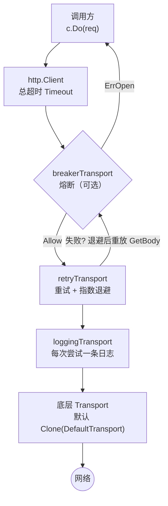

# httpclient

统一超时 / 重试 / 熔断 / 日志注入的 HTTP Client 工厂，替代散落各处的
`http.DefaultClient`。产物内嵌 `*http.Client`，全部标准方法直接可用。

## 特性

- **总超时**：`http.Client.Timeout` 覆盖连接、发送、响应与**全部重试**。
- **重试**：默认对幂等方法（GET/HEAD/PUT/DELETE/OPTIONS）在网络错误与
  429/500/502/503/504 时重试，指数退避；带体的请求靠 `GetBody` 原子重放，
  不可重放的请求体（自定义 ReadCloser）绝不盲试。
- **熔断**：可选接入 [`breaker`](../breaker/)，请求粒度 Allow/Record，
  5xx 与网络错误记失败；熔断时请求根本不出网，错误为 `breaker.ErrOpen`。
- **日志注入**：每次尝试一条 `slog` 记录（client/method/url/status/duration/error），
  默认 `slog.Default()`，推荐注入 `logger.Default()` 与全局日志底座打通。
- **可扩展**：`Transport` 字段可注入自定义 RoundTripper（认证、tracing），
  治理层会自动包在它外面。

## 架构



## 安装

```bash
go get github.com/zavierswong/go-infra/httpclient
```

## 快速开始

```go
package main

import (
	"errors"
	"log/slog"
	"time"

	infrabreaker "github.com/zavierswong/go-infra/breaker"
	"github.com/zavierswong/go-infra/httpclient"
	"github.com/zavierswong/go-infra/logger"
)

func main() {
	c := httpclient.New(httpclient.Config{
		Name:       "payment",              // 日志 "client" 字段
		Timeout:    5 * time.Second,        // 总超时（含重试）
		MaxRetries: 2,                      // 失败后额外重试 2 次
		Breaker: infrabreaker.New(infrabreaker.Config{ // 可选熔断
			Name:             "payment-api",
			FailureThreshold: 10,
			OpenTimeout:      30 * time.Second,
		}),
		Logger: logger.Default(), // 注入全局日志底座
	})

	resp, err := c.Get("https://api.example.com/ping")
	if err != nil {
		if errors.Is(err, infrabreaker.ErrOpen) {
			// 熔断中：走降级（本地缓存 / 默认值 / 快速失败）
		}
		return
	}
	defer resp.Body.Close()
}
```

## 配置参考

| 字段 | 类型 | 默认值 | 说明 |
|---|---|---|---|
| `Name` | `string` | `""` | 实例标识，写进日志 `client` 字段；多实例必填 |
| `Timeout` | `time.Duration` | `30s` | 单次请求总超时（含全部重试与退避） |
| `MaxRetries` | `int` | `2` | 失败后额外重试次数（总尝试 = 1 + MaxRetries） |
| `RetryDisabled` | `bool` | `false` | 显式关闭重试（0 是"未设置"，无法表达"不要默认 2 次"） |
| `Backoff` | `time.Duration` | `100ms` | 初始退避，逐次 ×2 |
| `MaxBackoff` | `time.Duration` | `2s` | 退避上限 |
| `RetryShould` | `func(*http.Response, error) bool` | 内置策略 | 自定义"结果是否值得重试"；可重放性检查始终生效 |
| `Breaker` | `*breaker.Breaker` | `nil` | 可选熔断器，请求粒度生效 |
| `Logger` | `*slog.Logger` | `slog.Default()` | 尝试日志；推荐 `logger.Default()` |
| `Transport` | `http.RoundTripper` | `Clone(DefaultTransport)` | 自定义底层传输 |

## 内置重试策略

| 条件 | 是否重试 |
|---|---|
| 网络错误（非 ctx 取消/超时，非 ErrOpen） | ✅ |
| ctx 主动取消 / 超时 | ❌（尊重调用方意图） |
| `breaker.ErrOpen` | ❌（熔断不是瞬时故障） |
| HTTP 429 / 500 / 502 / 503 / 504 | ✅ |
| 其他状态码（含 4xx 业务错误） | ❌ |
| 带请求体且 `GetBody == nil` | ❌（不可重放，永不重试） |
| 非幂等方法（POST/PATCH）且未自定义 RetryShould | ❌ |

> 带体的幂等方法（PUT/DELETE）依赖 `http.NewRequest` 对
> `*bytes.Buffer` / `*bytes.Reader` / `*strings.Reader` 自动设置的
> `GetBody`；用自定义 `io.ReadCloser` 构造的请求体不可重放。

## API 参考

| 符号 | 说明 |
|---|---|
| `New(cfg Config) *Client` | 工厂入口；零值字段取默认值 |
| `(*Client).Config() Config` | 读回归一化后的配置 |
| `*Client` 内嵌 `*http.Client` | `Do/Get/Head/Post/PostForm/CloseIdleConnections` 全部可用 |

## 注意事项

- **重试在 Transport 层，总超时在 Client 层**：`Config.Timeout` 必须大于
  「所有尝试 + 退避」之和，否则重试形同虚设（第一次尝试就用完了预算）。
- **非幂等请求默认不重试**：POST 可能已在上游生效，盲重试会导致重复下单。
  确认接口幂等（如带 Idempotency-Key）时，用 `RetryShould` 显式打开。
- **4xx 不重试**：401/403/404 是确定性失败，重试只放大流量。
- **熔断在重试外层**：一次请求只做一次 Allow/Record，重试不会连续
  推高熔断计数；5xx 会使熔断器计数，请把阈值调到覆盖重试后的残余失败。
- **日志量**：每次尝试一条 INFO（失败/WARN），高 QPS 场景注意采样或降级 Handler。
- **`DefaultTransport` 是共享的**：工厂内部对其克隆，不会污染全局；
  但自定义 `Transport` 请自行保证并发安全。

## 测试

```bash
go test ./httpclient/ -race -count=1
```

单测覆盖：5xx 重试与 body 重放、不可重放请求不重试、RetryDisabled、
ctx 取消终止重试循环、熔断开后请求不出网、日志字段注入、自定义
RetryShould、默认值归一化。

## 目录结构

```
httpclient/
├── httpclient.go      # Config / New / Client 工厂
├── transport.go       # 熔断 / 重试 / 日志三层 RoundTripper
├── httpclient_test.go # 8 个用例
└── example_test.go    # 可编译示例
```
