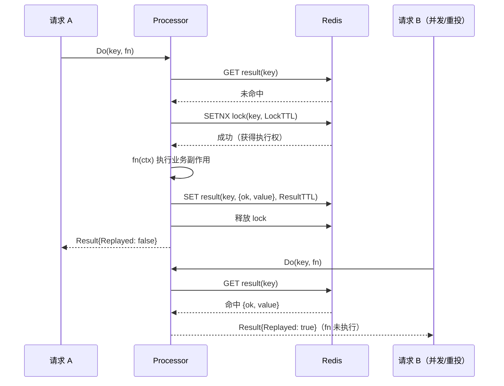

# idempotency

基于 Redis 的幂等执行器：同一业务 key 的操作在结果保留窗口内**至多成功执行一次**，
窗口内的重复请求直接复用缓存结果。建立在 `lock/` 之上——执行权互斥复用经过验证的
分布式锁（token + Lua + 看门狗），结果以 JSON envelope 缓存。

典型场景：MQ 消费去重（at-least-once 重投）、支付回调去重、重复提交拦截、
`httpclient` 重试非幂等请求的兜底——**有重试/重投的地方就该有幂等兜底**。

## 特性

- **执行互斥**：复用 `lock/` 分布式锁，同 key 并发请求只有一个真正执行
- **结果重放**：成功结果缓存 `ResultTTL`（默认 24h），窗口内重复调用 `Replayed=true` 零副作用返回
- **失败不缓存**：fn 失败后下次请求重新执行（失败可重试，成功才落结果）
- **看门狗防慢任务丢锁**：锁 TTL 的 1/3 周期自动续期，业务再慢不丟执行权；
  持有者崩溃后锁按 TTL 自动释放，等待方接管重试
- **丢失即取消**：锁意外丢失（如 Redis 长时间不可用导致续期失败）会取消 fn 的 ctx，
  fn 应及时响应退出，把双执行的窗口压到最小
- **panic 安全**：fn panic 时锁经 defer 释放，panic 原样向调用方传播
- **泛型 API**：`Do[T]` 编译期类型安全，结果经 JSON 编解码缓存

## 架构



崩溃恢复路径：持有者写完结果前崩溃 → 锁 TTL 到期自动释放 → 等待方抢到锁 →
**双重检查**结果缓存 → 未命中则重新执行。

## 安装

```bash
go get github.com/zavierswong/go-infra/idempotency
```

## 快速开始

```go
package main

import (
	"context"
	"time"

	"github.com/redis/go-redis/v9"

	"github.com/zavierswong/go-infra/idempotency"
)

func handleOrderPaid(p *idempotency.Processor, msgID string) error {
	// RabbitMQ at-least-once：同一条消息可能被投递多次，
	// 以 msgID 为幂等键保证扣款副作用只发生一次。
	res, err := idempotency.Do(context.Background(), p, "order-paid:"+msgID,
		func(ctx context.Context) (string, error) {
			return deductBalance(ctx) // 真正的业务副作用
		})
	if err != nil {
		return err // 失败不缓存，nack 重投后会重新执行
	}
	_ = res.Value
	_ = res.Replayed // true 表示此前已成功处理过，本次只是复用结果
	return nil
}

func deductBalance(ctx context.Context) (string, error) { return "ok", nil }

func main() {
	cli := redis.NewClient(&redis.Options{Addr: "127.0.0.1:6379"})
	// 也可复用 access/redis 的底层连接。
	p, err := idempotency.New(cli, idempotency.Config{})
	if err != nil {
		panic(err)
	}
	_ = handleOrderPaid(p, "m-1001")
	_ = time.Second
}
```

## 配置参考

| 字段 | 默认 | 说明 |
|---|---|---|
| `KeyPrefix` | `idem:` | 所有幂等 key（结果键与锁键）的统一前缀 |
| `LockTTL` | `30s` | 执行锁存活上限（持有者崩溃后锁最长残留这么久）；开看门狗后不必为慢任务调大 |
| `ResultTTL` | `24h` | 成功结果的保留窗口，即幂等窗口；按业务需要设置（支付回调建议 ≥24h） |
| `PollInterval` | `50ms` | 等待他人执行完成时的轮询间隔 |

## API

| 方法 | 说明 |
|---|---|
| `New(cli redis.UniversalClient, cfg Config) (*Processor, error)` | 创建执行器；cli 可复用 access/redis 连接 |
| `Do[T](ctx, p, key, fn) (Result[T], error)` | 包级泛型幂等执行（key 为空返回错误） |
| `Result[T].Value` | 本次执行或重放的业务结果 |
| `Result[T].Replayed` | true 表示结果来自缓存，fn 未执行 |
| `ErrInProgress` | 等待其他实例执行完成时 ctx 超时/取消（`errors.Is` 判断） |

## 注意事项

- **fn 失败不缓存结果**：下一次请求会重新执行。若 fn 有部分副作用（先扣款后发通知、
  通知失败），重新执行会重复扣款——fn 自身需对「失败路径的部分副作用」负责
  （事务回滚 / 补偿），本包保证的是**成功结果只执行一次**。
- **结果必须写成功才算成功**：fn 成功但结果写 Redis 失败时返回错误（调用方重试会
  重新执行 fn），绝不允许「调用方以为成功、下次请求又执行一遍」。
- **fn 需响应 ctx 取消**：执行锁意外丢失（Redis 长时间不可用导致看门狗续期失败）时
  fn 的 ctx 会被取消；不响应的话双执行窗口取决于锁 TTL 残留时间。
- **幂等 key 的选择**：必须是业务上的「同一件事」——MQ 用 `msgID`/`deliveryTag 不可靠`
  （重投 tag 会变），支付回调用 `订单号+金额+类型`，表单提交用 `请求指纹或客户端生成 ID`。
- **key 永不过期于窗口外**：`ResultTTL` 过后同一 key 再次请求会**重新执行**——这是设计
  行为（幂等窗口），不是缺陷；要求永久去重的场景请在 DB 层加唯一约束兜底。
- **T 是 JSON 编解码的**：需可 JSON 序列化；只关心成功与否可用 `struct{}`。

## 测试

```bash
go test ./idempotency/ -race -count=1
```

单测基于 miniredis，覆盖：执行与重放、并发去重（30 goroutine 只执行 1 次）、
失败不缓存、panic 释放锁、外部持锁等待、崩溃持有者接管（miniredis FastForward
推进虚拟时钟）、等待超时 `ErrInProgress`、结果 TTL 窗口过期后重新执行。

## 目录结构

```
idempotency/
├── idempotency.go    # Processor / Do / tryReplay / execute
├── idempotency_test.go
└── example_test.go
```
