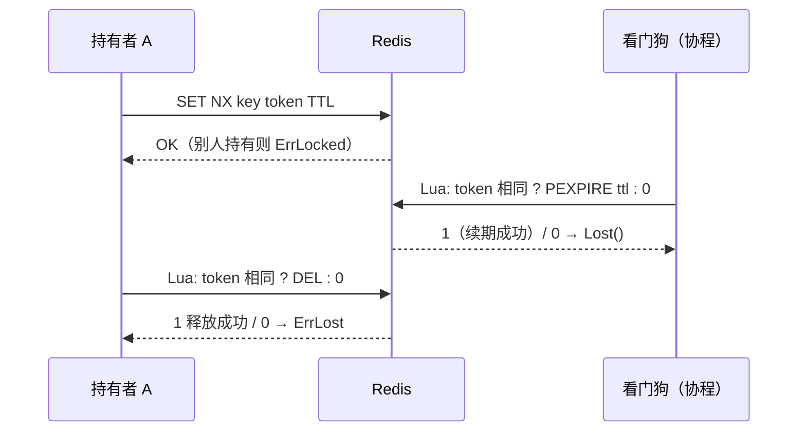

# lock

基于 Redis 的分布式锁：SETNX + 唯一令牌 + Lua 原子释放/续期，
可选看门狗自动续期。

接入 go-redis 的 `UniversalClient`（单机 / 哨兵 / Cluster / Ring 皆可），
可直接复用 `access/redis` 的连接。

## 特性

- **安全性三件套齐备**：crypto/rand 唯一令牌（防止删错别人的锁）、
  Lua 原子「比对 token 再 DEL/PEXPIRE」、强制 TTL（持有者崩溃后锁自行消失）。
- **看门狗自动续期**：短 TTL 拿锁 + 后台按 ttl/3 续期 —— 业务再慢不丢锁，
  进程崩溃后锁仍按 TTL 快速释放，两个矛盾一起解决。
- **丢失可感知**：续期失败时关闭 `Lost()` channel，业务可 select 中止。
- **非阻塞获取**：被持有时立即返回 `ErrLocked`，轮询节奏由调用方决定。
- **非单例**：一个 Redis 可派生多个 Client（不同前缀 / 不同续期策略）。

## 架构



## 安装

```bash
go get github.com/zavierswong/go-infra/lock
```

## 快速开始

```go
clk := lock.New(rdb, lock.WithKeyPrefix("go-infra:lock:"))

l, err := clk.Acquire(ctx, "order:123", 10*time.Second)
if errors.Is(err, lock.ErrLocked) {
	return ErrBusy // 别人持有，按业务处理
}
if err != nil {
	return err
}
defer l.Unlock(context.Background()) // 解锁用独立 ctx

// ... 临界区 ...
```

开启看门狗：

```go
clk := lock.New(rdb, lock.WithAutoRenew(0)) // 0 = 按 ttl/3 动态周期
```

可编译的完整示例见 `example_test.go`。

## 配置参考

| Option | 默认值 | 说明 |
|---|---|---|
| `WithKeyPrefix(p)` | 无 | 键前缀，多业务共用 Redis 时建议设置 |
| `WithAutoRenew(d)` | 关闭 | `d>0` 固定周期；`d<=0` 按 `ttl/3`（下限 100ms） |

## API 参考

| 函数 / 方法 | 说明 |
|---|---|
| `New(cli redis.UniversalClient, opts ...Option) *Client` | 创建锁客户端 |
| `(*Client).Acquire(ctx, key, ttl) (*Lock, error)` | 非阻塞获取；`ErrLocked` 表示被别人持有 |
| `(*Lock).Unlock(ctx) error` | 原子释放；锁已易主/过期返回 `ErrLost`，看门狗仍会停止 |
| `(*Lock).Refresh(ctx, ttl) error` | 手动续期；`ErrLost` 表示已不属于本次持有 |
| `(*Lock).Lost() <-chan struct{}` | 开启看门狗后，锁确定丢失时关闭 |
| `(*Lock).Key() / Token()` | 锁键与令牌，排查用 |

## 注意事项

- **解锁用独立 context。** 请求 ctx 在响应前就可能被取消，
  `defer l.Unlock(ctx)` 会解锁失败；用 `context.Background()`。
- **`ErrLocked` 不是错误路径时不要重试轰炸。** 忙等轮询请自行加间隔，
  或改为队列化。
- **`ErrLost` 之后必须停止操作共享资源。** 说明锁已易主（TTL 到期），
  继续执行会破坏互斥性；开了看门狗可用 `Lost()` 提前感知并中止。
- **看门狗续期失败即声明丢失**（包括 Redis 短暂不可达），这是保守取值：
  宁可误报丢失，也不在不确定时假装还持有锁。
- **时钟无关**：锁的正确性不依赖各机器时钟同步（TTL 由 Redis 单点计时）。
- **单 Redis 的可用性边界**：Redis 主从切换瞬间可能丢失锁
  （复制未完成）。需要极强互斥保证时考虑 RedLock 方案 —— 本包刻意未实现，
  多数业务场景强一致锁的收益配不上它的复杂度与延迟。

## 日志

本包不产生日志。锁的获取/释放结果由调用方处理；丢失事件经 `Lost()` 暴露。

## 测试

```bash
go test ./lock/... -race -count=1
```

单测基于 miniredis（支持 Lua / TTL / SetNX），确定性且无外部依赖：
获取/释放/重入、TTL 生效、令牌不匹配不删锁、续期、键前缀、
看门狗保活、Lost 通道、解锁幂等。

## 目录结构

```
lock/
├── lock.go           Client / Lock / Lua 脚本 / 看门狗
├── lock_test.go      miniredis 单元测试
├── example_test.go   可编译用法示例
└── README.md
```
