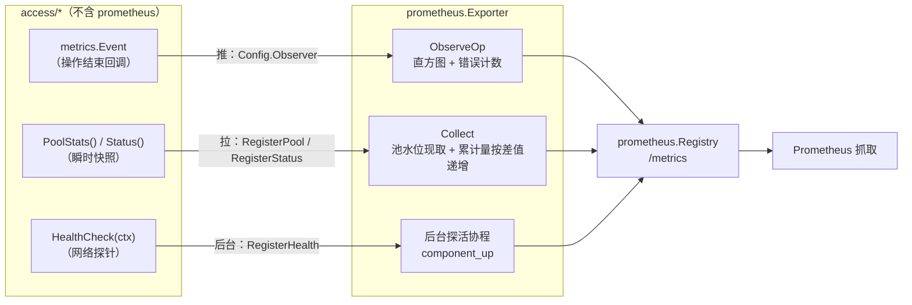

# prometheus

Prometheus 适配包：把 `metrics` 契约抛出的「可观测事实」翻译成
`prometheus/client_golang` 指标。

它是整个仓库里 `prometheus/client_golang` **唯一**的出现位置 ——
`access/*` 遵守「不 import prometheus」的分层铁律，只抛出事件与快照；
翻译成哪个监控后端是适配层的选择，本包就是那个适配层。

## 特性

- **一条线接全所有组件**：`mysql` / `postgres` / `redis` / `mongodb` /
  `rabbitmq` / `kafka` 共享同一份 `metrics` 契约，同一个 Exporter 通吃，
  dashboard 只需要一套 PromQL。
- **两条数据通道各就各位**：事件（推）→ 直方图 + 错误计数；
  快照（拉）→ scrape 时现取池水位，永远新鲜。
- **`component_up` 后台探活**：注册 `HealthCheck` 后自动启动后台协程，
  带独立超时，与 scrape 路径完全隔离。
- **拒绝恒为 0 的序列**：池计数器按差值递增、池水位首次非零才建序列，
  MySQL 上不会出现一条永远是 0 的 `pending_requests` 曲线。
- **错误语义与契约对齐**：`not_found`（零行 / 键不存在）不进错误率，
  单独一条 `not_found_total` —— 缓存命中率下降不会被误报成错误率飙升。

## 架构



## 安装

```bash
go get github.com/zavierswong/go-infra/prometheus
```

## 快速开始

本包与 `prometheus/client_golang` 同名，同文件同时使用时给本包起个别名
（约定 `infraprom`）：

```go
import (
	"github.com/prometheus/client_golang/prometheus"
	"github.com/prometheus/client_golang/prometheus/promhttp"

	infraprom "github.com/zavierswong/go-infra/prometheus"
)

pw := infraprom.New()
defer pw.Close()

reg := prometheus.NewRegistry()
reg.MustRegister(pw) // pw 自身实现 prometheus.Collector

db, _ := mysql.Open(mysql.Config{
	Dsn:      dsn,
	Name:     "order",   // 实例名，会成为标签
	Observer: pw,        // 事件通道
})
pw.RegisterPool(db.PoolStats)                              // 池水位
pw.RegisterHealth(metrics.ComponentMySQL, "order",
	db.HealthCheck)                                        // 探活

mux.Handle("/metrics", promhttp.HandlerFor(reg, promhttp.HandlerOpts{}))
```

可编译的完整示例见 `example_test.go`。

## 指标清单

### 事件通道（全部组件）

| 指标 | 标签 | 说明 |
|---|---|---|
| `go_infra_operation_duration_seconds` | component, instance, op | 耗时直方图，收全部事件（成功+失败），`_count` 即总操作数 |
| `go_infra_operation_errors_total` | component, instance, op, reason | 失败计数，**不含** `not_found` |
| `go_infra_operation_not_found_total` | component, instance, op | 零行 / 键不存在，单独观察未命中 |

错误率：`rate(errors_total) / rate(duration_seconds_count)`。

### 池快照（`RegisterPool`）

| 指标 | 类型 | 说明 |
|---|---|---|
| `go_infra_pool_max_open_connections` | Gauge | 池上限（Redis 是 `MaxActiveConns`，0 表示无硬上限） |
| `go_infra_pool_open_connections` | Gauge | 已建立连接总数 |
| `go_infra_pool_in_use_connections` | Gauge | 使用中连接数 |
| `go_infra_pool_idle_connections` | Gauge | 空闲连接数 |
| `go_infra_pool_pending_requests` | Gauge | 排队等待数（仅 Redis / MongoDB；SQL 侧恒 0 不出序列） |
| `go_infra_pool_wait_total` | Counter | 排队等待次数，持续增长 = 池太小 |
| `go_infra_pool_wait_duration_seconds_total` | Counter | 排队等待总时长 |
| `go_infra_pool_closed_total{reason}` | Counter | 按池策略关闭：`max_idle` / `max_idle_time` / `max_lifetime` |
| `go_infra_pool_hits_total` / `misses_total` | Counter | Redis 空闲池命中 / 未命中 |
| `go_infra_pool_timeouts_total` / `unusable_total` / `stale_total` | Counter | Redis / MongoDB 专有 |

池水位 Gauge 首次非零才建序列；累计量只在差值 > 0 时递增。

### Kafka 缓冲水位（`RegisterKafkaStatus`）

Kafka 没有"连接池"意义上的水位，这里给的是 franz-go 内部的生产/消费
缓冲积压 —— 持续增长就是 broker 处理不过来或 handler 成了瓶颈的最早信号。

| 指标 | 类型 | 说明 |
|---|---|---|
| `go_infra_kafka_buffered_produce_records` | Gauge | 已入队但未被 broker 确认的记录数；逼近 `MaxBufferedRecords` = 背压/集群异常 |
| `go_infra_kafka_buffered_produce_bytes` | Gauge | 生产缓冲字节量 |
| `go_infra_kafka_buffered_fetch_records` | Gauge | 已拉取、handler 尚未处理完的记录数（消费组侧） |
| `go_infra_kafka_buffered_fetch_bytes` | Gauge | 待消费缓冲字节量 |

水位 Gauge 同样遵循"恒为 0 不建序列"：纯生产端不会出现 fetch 侧序列。
`Closed` 落在共享的 `go_infra_status_closed` 上，始终写入。

事件通道对组件无关：kafka 的 `publish` / `consume` / `commit` /
`reconnect` / `ping` 把 `Config.Observer` 指到 Exporter 即自动流入，
无需额外注册。

```go
producer, _ := kafka.Open(kafka.Config{
	Brokers:  []string{"127.0.0.1:9092"},
	Name:     "events",
	Observer: pw, // 事件通道
})
pw.RegisterHealth(metrics.ComponentKafka, "events", producer.HealthCheck)
pw.RegisterKafkaStatus(func() infraprom.KafkaStatus {
	s := producer.Status()
	return infraprom.KafkaStatus{
		Component:              metrics.ComponentKafka,
		Instance:               s.Instance,
		Closed:                 s.Closed,
		ProduceBufferedRecords: s.ProduceBufferedRecords,
		ProduceBufferedBytes:   s.ProduceBufferedBytes,
	}
})
```

### 探活与组件状态

| 指标 | 类型 | 说明 |
|---|---|---|
| `go_infra_component_up` | Gauge | 最近一次探活结果，1 / 0 |
| `go_infra_status_closed` | Gauge | 客户端被应用层 Close（rabbitmq / kafka；kafka 消费组侧是 Run 是否已退出） |
| `go_infra_status_connected` | Gauge | 底层连接是否存活 |
| `go_infra_status_publish_ready` | Gauge | 发布通道是否可用 |

## 配置参考

| Option | 默认值 | 说明 |
|---|---|---|
| `WithNamespace(ns)` | `go_infra` | 指标名前缀 |
| `WithBuckets(b)` | 0.5ms ~ 10s，14 桶 | 耗时直方图桶边界，启动后不可变 |
| `WithHealthInterval(d)` | `30s` | 探活周期 |
| `WithHealthTimeout(d)` | `5s` | 单次探活超时 |

## API 参考

| 函数 / 方法 | 说明 |
|---|---|
| `New(opts ...Option) *Exporter` | 创建 Exporter |
| `(*Exporter).ObserveOp(metrics.Event)` | 实现 `metrics.Observer`，可直接当 `Config.Observer` 用 |
| `(*Exporter).RegisterPool(func() metrics.PoolStats)` | 注册池快照来源（`db.PoolStats` 方法值） |
| `(*Exporter).RegisterStatus(func() MQStatus)` | 注册组件状态（rabbitmq `Status()` 搬运成 `MQStatus`） |
| `(*Exporter).RegisterKafkaStatus(func() KafkaStatus)` | 注册 kafka 缓冲水位（`Client.Status()` / `Group.Status()` 搬运成 `KafkaStatus`） |
| `(*Exporter).RegisterHealth(component, instance, func(ctx) error)` | 注册探活；首次注册自动启动后台协程 |
| `(*Exporter).Describe / Collect` | 实现 `prometheus.Collector` |
| `(*Exporter).Close()` | 停掉探活协程，重复调用安全 |

## 注意事项

- **与 `prometheus/client_golang` 同名，同时 import 时需要别名。** 包内
  统一用 `prom` 别名引用 client_golang；使用方建议用 `infraprom` 别名
  引用本包（见快速开始）。
- **一个 Exporter 只注册进一个 Registry。** 池计数器靠相邻两次
  Collect 的差值递增，被两个 Registry 同时 scrape 会把增量劈成两半。
- **instance 必须填。** `Config.Name` 为空时事件与快照都会落到
  `instance="-"` 占位序列，多实例曲线会叠在一起 —— 这是退化行为，
  不是设计给多实例用的。
- **池计数器的首次非零会把当前值整体计入。** Exporter 晚于客户端启动
  是常态，从 0 追到当前值是合理近似；速率计算在启动初期可能偏高。
- **探活失败只影响 `component_up`**，不会产生事件、也不会计入错误率
  （探活是后台行为，与业务流量无关）。
- **kafka 消费组的 Instance 建议带组名后缀。** 生产端与消费组是两个客户端，
  fetch 水位在 `Group.Status()` 里；注册消费组来源时把 Instance 写成
  `"events-consumer"` 这类后缀形式，避免与父 Client 的生产端序列混叠。
- **性能：** 事件路径只写内存（client_golang 的 metric 并发安全且无锁竞争
  热点），符合 `metrics.Observer` 「绝不阻塞」的约束。

## 日志

本包不产生日志：指标本身就是观测产物，再打日志是重复。

## 测试

```bash
go test ./prometheus/... -race -count=1
```

单元测试覆盖：事件分流（not_found 不进错误率）、空 Instance 占位、
池水位按需建序列与回落、计数器差值递增与回退保护、closed 原因标签、
状态快照、kafka 缓冲水位（建序列 / 回落 / 占位符）、探活立即执行 / 失败 /
超时、nil 来源防护、跨组件隔离。
`example_test.go` 保证文档代码可编译、不随 API 失效。

## 目录结构

```
prometheus/
├── exporter.go      Exporter 定义、Option、指标向量
├── observer.go      事件翻译（metrics.Observer 实现）
├── register.go      池 / 状态 / 探活注册与后台协程
├── collector.go     prometheus.Collector 实现（含池差值逻辑）
├── exporter_test.go 单元测试
└── example_test.go  可编译用法示例
```
