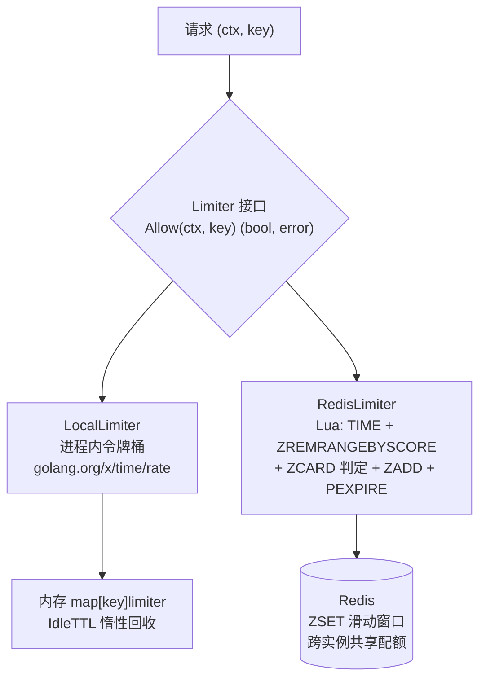

# ratelimit

两种限流器，一个接口：

- **`LocalLimiter`** —— 进程内多 key 令牌桶（基于 `golang.org/x/time/rate`），
  零网络开销，保护单个实例。
- **`RedisLimiter`** —— Redis 滑动窗口（Lua 一次往返完成清理/判定/记账），
  跨实例共享配额，保护整个集群。

## 特性

- **接口统一**：`Allow(ctx, key) (bool, error)`，按场景替换实现；
  key 粒度由调用方定（接口名 / 用户 ID / IP）。
- **算法各就各位**：令牌桶允许突发（平均速率语义）；滑动窗口严格
  限制任意窗口内请求数（配额语义，无边界突刺）。
- **Redis 版取服务端时间**：窗口打分用 Redis 的 `TIME`，机器时钟漂移
  不会造成"某台机器的记录提前出窗"。
- **本地版无泄漏**：空闲 key 按 IdleTTL 惰性回收，不开后台协程。

## 架构



## 安装

```bash
go get github.com/zavierswong/go-infra/ratelimit
```

## 快速开始

本地令牌桶（单实例保护）：

```go
rl := ratelimit.NewLocal(ratelimit.LocalConfig{
	Rate:  100, // 平均每秒 100 次
	Burst: 200, // 允许 200 的瞬时突发
})

ok, _ := rl.Allow(ctx, "search-api")
if !ok {
	return ErrTooManyRequests
}
```

Redis 滑动窗口（集群级每用户配额）：

```go
rl := ratelimit.NewRedis(rdb, ratelimit.RedisConfig{
	Window: time.Minute,
	Limit:  60, // 每用户每分钟 60 次
})

ok, err := rl.Allow(ctx, "user:42")
if err != nil {
	// Redis 挂了：fail-open 放行还是 fail-close 拒绝，业务自己定。
}
if !ok {
	return ErrQuotaExceeded
}
```

可编译的完整示例见 `example_test.go`。

## 配置参考

### LocalConfig

| 字段 | 默认值 | 说明 |
|---|---|---|
| `Rate` | — | 每 key 每秒补充令牌数 |
| `Burst` | — | 桶容量 = 最大瞬时突发 |
| `IdleTTL` | `10m` | key 空闲多久后回收（防 map 无界增长） |

### RedisConfig

| 字段 | 默认值 | 说明 |
|---|---|---|
| `Window` | `1m` | 窗口长度 |
| `Limit` | — | 窗口内最多放行次数（必填 > 0） |
| `Prefix` | `go-infra:rl:` | 键前缀，多套限流共用 Redis 时建议区分 |

## API 参考

| 函数 / 方法 | 说明 |
|---|---|
| `NewLocal(LocalConfig) *LocalLimiter` | 创建本地令牌桶，管理任意多 key |
| `NewRedis(cli redis.UniversalClient, RedisConfig) *RedisLimiter` | 创建滑动窗口限流器 |
| `Allow(ctx, key) (bool, error)` | 统一判定入口，不等待 |
| `(*LocalLimiter).Wait(ctx, key) error` | 阻塞排队等令牌（Redis 版无对应实现） |

## 注意事项

- **Redis 故障语义由你决定。** `Allow` 把网络错误原样返回；
  fail-open（放行）与 fail-close（拒绝）都是合理的业务选择，
  本包不替你选。
- **滑动窗口的每次判定是一次 Redis 往返。** 超高 QPS 下把本地桶挡在
  前面（先本地后 Redis），或提高 `Limit` 粒度分摊。
- **窗口边界仍然平滑。** Lua 里先 ZREMRANGEBYSCORE 清出窗记录，
  不依赖 key TTL —— 只靠 TTL 会出现窗口边界 2 倍突刺。
- **`Allow` 与 `Wait` 的区别**：`Allow` 不消耗未来配额、不等待；
  `Wait` 排队等令牌，只在本地方案有意义（分布式排队请用队列或重试）。
- **member 唯一性**：同一微秒的多次写入用进程内原子序号区分，
  避免 ZADD member 撞车导致计数偏小。
- **已知局限**：Redis 版对同 key 高并发下是"读-判-写"串行的
  （Lua 保证原子，但吞吐受单 key 串行化限制）；需要更高吞吐时
  按用户/接口分片 key。

## 日志

本包不产生日志；拒绝事件可由调用方按需记录。

## 测试

```bash
go test ./ratelimit/... -race -count=1
```

本地桶：突发/拒绝、多 key 隔离、速率补充、空闲回收、Wait 排队、并发。
Redis 窗口（miniredis）：限额、隔离、窗口过期重置、前缀、故障上抛。
`example_test.go` 保证文档代码可编译、不随 API 失效。

## 目录结构

```
ratelimit/
├── local.go           本地多 key 令牌桶
├── redis.go           Redis 滑动窗口（Lua）
├── ratelimit_test.go  单元测试
├── example_test.go    可编译用法示例
└── README.md
```
