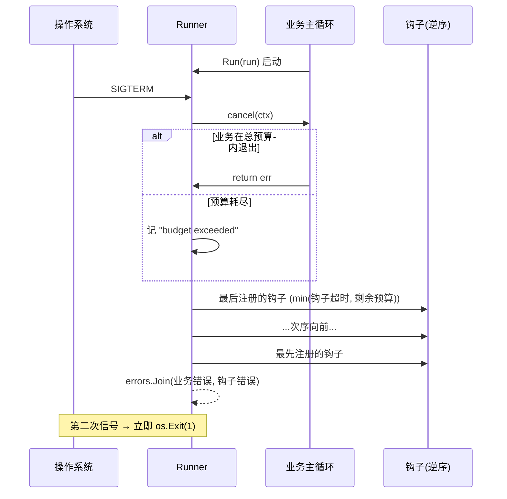

# shutdown

统一的优雅退出：signal 收口 → 通知业务退出 → 按注册逆序执行清理钩子。

## 特性

- **信号收口**：一处监听 SIGINT/SIGTERM，业务代码不再各自
  `signal.Notify`。
- **关闭顺序 = 注册逆序**：依赖上层资源的组件（HTTP server、consumer）
  先停，最底层连接池最后关 —— 与注册顺序对应，符合依赖倒置。
- **双重超时**：总预算（默认 30s，覆盖业务退出 + 全部钩子）+
  每钩子独立超时（默认 10s，可按钩子覆盖），单个钩子卡死不拖垮全局。
- **二次信号强制退出**：任何优雅流程都可能卡死，第二次信号直接
  `os.Exit(1)`，给运维硬退出兜底。
- **健壮性**：业务主循环与钩子的 panic 均 recover 转错误，
  单点 bug 不阻断清理链。

## 流程



## 安装

```bash
go get github.com/zavierswong/go-infra/shutdown
```

## 快速开始

```go
r := shutdown.New(shutdown.Config{
	Logger:  logger.Default(),
	Timeout: 30 * time.Second,
})

// 注册顺序 = 依赖顺序：最先注册的最后关闭。
r.Add("db-pool", func(context.Context) error { return db.Close() })
r.Add("mq-consumer", func(context.Context) error { return consumer.Close() })
r.AddTimeout("http-server", 15*time.Second, func(ctx context.Context) error {
	return srv.Shutdown(ctx)
})

if err := r.Run(func(ctx context.Context) error {
	return consumer.Run(ctx) // 收到信号时 ctx 被取消，尽快返回
}); err != nil {
	slog.Error("exit with error", "error", err)
}
```

## 配置参考

| 字段 | 类型 | 默认值 | 说明 |
|---|---|---|---|
| `Signals` | `[]os.Signal` | SIGINT, SIGTERM | 触发优雅退出的信号 |
| `Timeout` | `time.Duration` | `30s` | 信号 → 全部钩子完成的总预算 |
| `HookTimeout` | `time.Duration` | `10s` | 单钩子默认超时（`AddTimeout` 可覆盖） |
| `Logger` | `*slog.Logger` | `slog.Default()` | 信号与钩子日志；推荐 `logger.Default()` |

## API 参考

| 符号 | 说明 |
|---|---|
| `New(Config) *Runner` | 构造 |
| `(*Runner).Add(name, HookFunc)` | 注册钩子（默认超时）；后注册的先执行 |
| `(*Runner).AddTimeout(name, d, HookFunc)` | 注册带独立超时的钩子；须在 Run 前完成 |
| `(*Runner).Run(run func(ctx) error) error` | 运行业务 + 接管退出；返回业务与钩子错误的 Join |

## 注意事项

- **业务必须响应 ctx 取消**：`Run` 传入的 ctx 被取消后主循环应尽快返回
  （HTTP 用 `Shutdown`、consumer 停止拉取）；无响应则被总预算兜底，
  错误信息为 "run did not exit within budget"。
- **业务正常结束也会执行钩子**：清理语义统一，别把"只该在崩溃时清理"
  的逻辑放进钩子。
- **钩子拿到的 ctx 截止日 = min(钩子超时, 总预算剩余)**：预算快耗尽时
  后面的钩子会立即拿到已超时的 ctx —— 把耗时最不确定的钩子放前面注册
  （即最后执行）时要意识到这一点。
- **钩子错误不中断链路**：某钩子失败/超时/panic 后继续执行其余钩子，
  全部错误经 `errors.Join` 汇总返回。
- **Run 不可重入**：一个 Runner 只跑一次；钩子须在 Run 前注册完。
- **测试提示**：测试请用 `Config.Signals: []os.Signal{syscall.SIGUSR1}`
  并向自身发信号，避免 SIGINT/SIGTERM 干扰开发环境（IDE 终端、shell）。

## 测试

```bash
go test ./shutdown/ -race -count=1
```

单测覆盖：信号触发逆序清理、业务自行结束仍清理、钩子超时不阻断、
总预算兜底、钩子 panic 恢复。

## 目录结构

```
shutdown/
├── shutdown.go      # Runner / 信号 / 预算 / 钩子执行
├── shutdown_test.go # 5 个用例（真实信号驱动）
└── example_test.go  # 可编译示例
```
