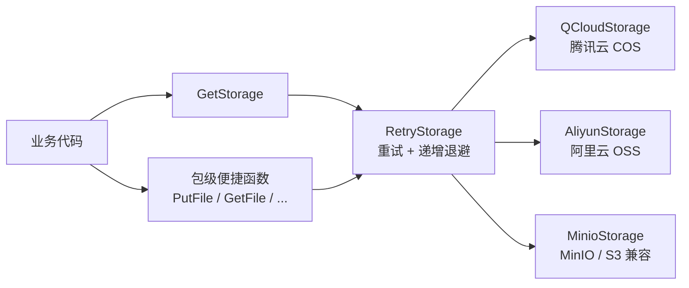
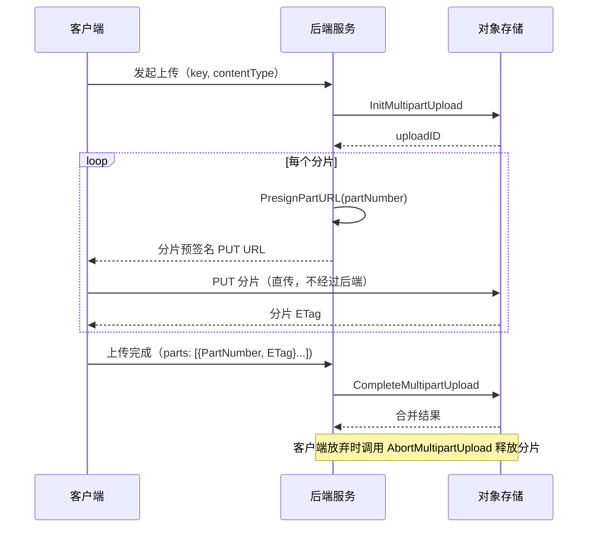

# storage

`go-infra` 统一对象存储包。通过一个 `Storage` 接口屏蔽底层差异，同一套业务代码可在 **腾讯云 COS**、**阿里云 OSS**、**MinIO**（含自建 S3 兼容存储）之间切换，内置**重试包装器**与**全局单例**两种使用方式。

## 特性

- **统一接口**：上传、下载、删除、复制、列举、元信息、存在性检查、预签名 URL（GET / PUT）一套 API 全覆盖；
- **多后端**：按配置 `type` 一键切换 `qcloud` / `aliyun` / `minio`，业务代码零改动；
- **内置重试**：`RetryStorage` 装饰器对所有网络操作自动重试，退避间隔随重试次数递增；
- **分片直传**：客户端直传（Presigned PUT + 分片上传）三后端全支持；
- **全局便捷函数**：`Setup` 一次，之后 `PutFile` / `GetFile` 等包级函数随处可用；
- **结构化日志**：初始化与重试过程通过 `go-infra/logger` 输出，未初始化 logger 也能正常工作（logger 内部有兜底默认实例）。

## 架构



`Setup(cfg)` 根据 `cfg.Type` 创建具体后端 → 自动包一层 `RetryStorage` → 存入全局单例 `globalStorage`。

## 安装

```bash
go get github.com/zavierswong/go-infra/storage
```

依赖的三个云厂商 SDK 会随 `go-infra` 一起引入：

- `github.com/tencentyun/cos-go-sdk-v5`
- `github.com/aliyun/aliyun-oss-go-sdk`
- `github.com/minio/minio-go/v7`

## 快速开始

```go
package main

import (
    "bytes"
    "context"
    "fmt"
    "time"

    "github.com/zavierswong/go-infra/storage"
)

func main() {
    // 1. 应用启动时初始化一次（以 MinIO 为例）
    err := storage.Setup(storage.Config{
        Type:       storage.StorageTypeMinio,
        Endpoint:   "localhost:9000",
        Bucket:     "my-bucket",
        SecretID:   "minioadmin",
        SecretKey:  "minioadmin",
        UseSSL:     false,
        MaxRetries: 3,
        RetryDelay: 100, // 毫秒
        Timeout:    10,  // 秒
    })
    if err != nil {
        panic(err)
    }

    ctx := context.Background()

    // 2. 上传
    content := []byte("hello storage")
    err = storage.PutFile(ctx, "demo/hello.txt", bytes.NewReader(content),
        int64(len(content)), "text/plain")

    // 3. 判断存在 / 拿访问 URL / 预签名 URL
    exists, _ := storage.IsFileExist(ctx, "demo/hello.txt")
    url := storage.GetFileURL("demo/hello.txt")
    presigned, _ := storage.GetFilePresignedURL(ctx, "demo/hello.txt", time.Hour)

    // 4. 下载（调用方负责 Close）
    rc, err := storage.GetFile(ctx, "demo/hello.txt")
    if err == nil {
        defer rc.Close()
    }

    fmt.Println(exists, url, presigned)
}
```

### 各后端最小配置

**腾讯云 COS**

```go
storage.Setup(storage.Config{
    Type:      storage.StorageTypeQCloud,
    Region:    "ap-guangzhou",
    Bucket:    "my-bucket-1250000000",
    SecretID:  "<SecretId>",
    SecretKey: "<SecretKey>",
    Timeout:   10,
})
```

**阿里云 OSS**（`Endpoint` 留空时按 `Region` 推导公网 endpoint `https://oss-<region>.aliyuncs.com`）

```go
storage.Setup(storage.Config{
    Type:      storage.StorageTypeAliyun,
    Region:    "oss-cn-hangzhou",
    Bucket:    "my-bucket",
    SecretID:  "<AccessKeyId>",
    SecretKey: "<AccessKeySecret>",
    Timeout:   10,
})
```

**MinIO / 自建 S3 兼容存储**（bucket 不存在时**初始化阶段会自动创建**）

```go
storage.Setup(storage.Config{
    Type:      storage.StorageTypeMinio,
    Endpoint:  "minio.internal:9000", // 可带 http(s):// 前缀，前缀决定 UseSSL
    Bucket:    "my-bucket",
    SecretID:  "<AccessKey>",
    SecretKey: "<SecretKey>",
    UseSSL:    false,
})
```

配合 viper 等 `mapstructure` 配置框架时，字段名与 `mapstructure` tag 一致，可直接反序列化：

```yaml
storage:
  type: qcloud
  region: ap-guangzhou
  bucket: my-bucket-1250000000
  secret_id: xxx
  secret_key: xxx
  max_retries: 3
  retry_delay: 100
  timeout: 10
```

## 配置参考

| 字段 | mapstructure | 必填 | 说明 |
|---|---|---|---|
| `Type` | `type` | ✅ | `qcloud` / `aliyun` / `minio` |
| `Region` | `region` | COS ✅ / OSS（无 Endpoint 时）✅ | 地域，如 `ap-guangzhou` |
| `Bucket` | `bucket` | ✅ | 存储桶名称 |
| `SecretID` | `secret_id` | ✅ | AccessKey ID |
| `SecretKey` | `secret_key` | ✅ | AccessKey Secret |
| `Endpoint` | `endpoint` | MinIO ✅ | MinIO 地址；COS/OSS 可用于覆盖默认域名 |
| `UseSSL` | `use_ssl` | — | MinIO 是否 HTTPS（Endpoint 带 `https://` 前缀时自动判定） |
| `BaseURL` | `base_url` | — | 自定义访问 URL 前缀（须已包含 bucket 或为 CDN 域名），留空则按后端规则推导 |
| `MaxRetries` | `max_retries` | — | 失败重试次数，`0` 表示只执行一次不重试 |
| `RetryDelay` | `retry_delay` | — | 基础重试间隔（毫秒） |
| `Timeout` | `timeout` | — | 请求超时（秒），建议显式设置 |
| `PublicRead` | `public_read` | — | 桶是否公开读；false（默认，私有桶）时 `GetObjectURL` 返回预签名 URL |
| `MaxFileSize` | `max_file_size` | — | 单文件最大大小（bytes），>0 时 `PutObject` 超限直接报错 |
| `MaxParts` | `max_parts` | — | 最大分片数，>0 时 `CompleteMultipartUpload` 校验；缺省 10000 |
| `PresignedURLExpires` | `presigned_url_expires` | — | 私有桶 `GetObjectURL` 的签名有效期（秒），缺省 3600 |

> 注意：除 `Type` / `Bucket` / `SecretID` / `SecretKey` 外，`Setup` 不会为其他字段填充默认值。未设置 `Timeout` 时 COS 的 HTTP Client 将没有超时限制，请务必显式配置。
>
> **破坏性变更（2026-09-17）**：`PartSize` / `FileRecordTTL` / `MultipartTTL` / `BatchTTL` 四个字段已删除——它们是上层上传业务的会话概念，公共库无法兑现语义；`MaxFileSize` / `MaxParts` / `PresignedURLExpires` 由本包真实生效（见上表）。mapstructure 会忽略多余配置键，配置文件无需强制清理。

## API 参考

### Storage 接口

| 方法 | 说明 | 备注 |
|---|---|---|
| `PutObject(ctx, key, reader, size, contentType)` | 上传对象 | 重试自动回卷 Seekable reader |
| `GetObject(ctx, key)` | 下载对象，返回 `io.ReadCloser` | 调用方负责 `Close` |
| `DeleteObject(ctx, key)` | 删除对象 | |
| `GetObjectURL(key)` | 访问 URL | 公开读桶→永久拼接 URL；私有桶→预签名 URL（`PresignedURLExpires`） |
| `GetPresignedURL(ctx, key, expires)` | 预签名 GET URL | 私有读临时访问 |
| `PresignedPutURL(ctx, key, contentType, expires)` | 预签名 PUT URL | 客户端直传 |
| `IsExist(ctx, key)` | 对象是否存在 | 不存在的对象返回 `(false, nil)` 而非错误 |
| `ListObjects(ctx, prefix)` | 列出前缀下所有 key | 内部自动翻页；**全量入内存，大前缀用 Page 版** |
| `ListObjectsPage(ctx, prefix, maxKeys, marker)` | 分页列出 | 返回本页 keys + NextMarker |
| `CopyObject(ctx, srcKey, dstKey)` | 同桶内复制 | |
| `GetObjectInfo(ctx, key)` | 元信息（大小/类型/ETag/修改时间） | |
| `GetProvider(ctx)` | 返回后端名称 | `腾讯云` / `阿里云` / `本地存储` |

### MultipartUploader 接口（与 Storage 解耦）

| 方法 | 说明 |
|---|---|
| `InitMultipartUpload(ctx, key, contentType)` | 初始化分片上传，返回 uploadID |
| `PresignPartURL(ctx, key, uploadID, partNumber, expires)` | 分片预签名 PUT URL |
| `CompleteMultipartUpload(ctx, key, uploadID, parts)` | 合并分片（校验 `MaxParts`） |
| `AbortMultipartUpload(ctx, key, uploadID)` | 取消分片上传 |

> 三后端与 RetryStorage 均同时实现两个接口；不需要分片上传的使用方
> （mock、依赖注入）只需依赖 `Storage`。需要分片能力时断言：
>
> ```go
> mp, ok := storage.GetStorage().(storage.MultipartUploader)
> ```

### 数据类型

```go
type ObjectInfo struct {
    Key          string
    Size         int64
    ContentType  string
    LastModified time.Time
    ETag         string
}

type MultipartUploadPart struct {
    PartNumber int    // 从 1 开始
    ETag       string
}
```

### 全局便捷函数

`Setup` 成功后可直接使用（未初始化时返回 `存储未初始化` 错误）：

| 函数 | 等价于 |
|---|---|
| `PutFile(ctx, key, reader, size, contentType)` | `GetStorage().PutObject(...)` |
| `GetFile(ctx, key)` | `GetStorage().GetObject(...)` |
| `DeleteFile(ctx, key)` | `GetStorage().DeleteObject(...)` |
| `GetFileURL(key)` | `GetStorage().GetObjectURL(...)` |
| `GetFilePresignedURL(ctx, key, expires)` | `GetStorage().GetPresignedURL(...)` |
| `GetPresignedPutURL(ctx, key, contentType, expires)` | `GetStorage().PresignedPutURL(...)` |
| `IsFileExist(ctx, key)` | `GetStorage().IsExist(...)` |

更完整的能力（复制、列举、元信息、分片上传）通过 `storage.GetStorage()` 拿到实例后调用。

### 不想用全局单例？

各后端可直接实例化，也可手动包上重试：

```go
impl, err := storage.NewMinioStorage(cfg)          // 或 NewQCloudStorage / NewAliyunStorage
st := storage.NewRetryStorage(impl, 3, 100*time.Millisecond)
st.PutObject(ctx, "a.txt", r, n, "text/plain")
```

## 客户端直传（分片上传）

三个后端均支持分片上传（基于各自官方 SDK 的 multipart 能力）。典型流程：



要点：

- 分片预签名 URL 由 `PresignPartURL` 生成，`uploadID` 与 `partNumber` 绑定进签名；
- `CompleteMultipartUpload` 需按顺序提交各分片的 `PartNumber`（从 1 开始）与对象存储返回的 `ETag`；
- 上传失败/用户取消时务必 `AbortMultipartUpload`，否则已上传分片会持续占用存储并计费。

### 服务端代码示例（三后端通用）

接口已统一，以下代码对 `qcloud` / `aliyun` / `minio` 均适用：

```go
// 1. 初始化分片上传，拿到 uploadID（建议落库，并利用 Config.MultipartTTL 控制过期）
uploadID, err := st.InitMultipartUpload(ctx, "video/demo.mp4", "video/mp4")
if err != nil { ... }

// 2. 为每个分片生成预签名 PUT URL，下发给客户端
partSize := int64(5 << 20) // 5MB，可来自 Config.PartSize
totalParts := (fileSize + partSize - 1) / partSize
urls := make([]string, 0, totalParts)
for n := 1; int64(n) <= totalParts; n++ {
    u, err := st.PresignPartURL(ctx, "video/demo.mp4", uploadID, n, 30*time.Minute)
    if err != nil { ... }
    urls = append(urls, u)
}

// 3. 客户端逐片 PUT（直传，不经过后端），回传各分片 ETag 后：
parts := []storage.MultipartUploadPart{
    {PartNumber: 1, ETag: "<客户端回传的分片1 ETag>"},
    {PartNumber: 2, ETag: "<客户端回传的分片2 ETag>"},
}
err = st.CompleteMultipartUpload(ctx, "video/demo.mp4", uploadID, parts)

// 4.（用户取消时）释放已上传分片
err = st.AbortMultipartUpload(ctx, "video/demo.mp4", uploadID)
```

### 各后端分片上传实现细节

**阿里云 OSS**（基于 `aliyun-oss-go-sdk` 的 `multipart.go` 能力）：

| 项 | 说明 |
|---|---|
| 初始化 | `bucket.InitiateMultipartUpload(key, oss.ContentType(ct))`，返回 `InitiateMultipartUploadResult.UploadID` |
| 分片预签名 | `bucket.SignURL(key, oss.HTTPPut, expires, oss.AddParam("uploadId", id), oss.AddParam("partNumber", n))` —— `uploadId`/`partNumber` 属于 OSS 签名子资源（signKeyList），缺签会被 403 |
| 合并 | 构造 `oss.InitiateMultipartUploadResult{Bucket, Key, UploadID}` 复原 IMUR 后提交 `[]oss.UploadPart`；SDK 内部按 PartNumber 排序 |
| 约束 | PartNumber 范围 1–10000；除最后一片外最小 100KB |

**MinIO**（基于 `minio-go/v7` 的 `Core` 低层 API）：

| 项 | 说明 |
|---|---|
| 初始化 | `core.NewMultipartUpload(ctx, bucket, key, minio.PutObjectOptions{ContentType: ct})`，`core` 为内嵌 `minio.Core{Client: client}` |
| 分片预签名 | `client.Presign(ctx, http.MethodPut, bucket, key, expires, url.Values{"uploadId": ..., "partNumber": ...})` —— query 参数会进 SigV4 签名 |
| 合并 | `core.CompleteMultipartUpload(ctx, bucket, key, uploadID, []minio.CompletePart{{PartNumber, ETag}}, minio.PutObjectOptions{})` |
| 约束 | 分片 PUT 时 Content-Type 不在签名内，客户端可自行携带；单分片建议 ≥5MB（合并前除最后一片外服务端会校验） |

**客户端 PUT 分片时的注意点**：阿里云与 MinIO 的分片预签名 URL 均为 `PUT` 请求，分片内容放请求 body、不带额外 header 即可；腾讯云 COS 的整体 `PresignedPutURL` 签名绑定了 Content-Type，客户端必须携带与申请时相同的 `Content-Type`（分片 URL 无此要求）。

## 重试机制

`Setup` 返回的实例自动经过 `RetryStorage` 包装：

- 覆盖所有网络操作（上传、下载、删除、预签名、列举、复制、元信息、分片初始化/合并/取消）；`GetObjectURL` 为本地拼接、`PresignPartURL` 为纯签名计算，不重试；
- 失败后按 `RetryDelay × 已重试次数` 递增间隔退避（如 `RetryDelay=100ms`、`MaxRetries=3`，退避依次为 100ms、200ms、300ms）；
- 最终失败时返回携带操作名与重试次数的包装错误：`存储操作 PutObject 失败，已重试 3 次: ...`；
- 每次重试通过 `go-infra/logger` 输出 Warn 日志。

**重试策略细节（2026-09-17 修正）**：

1. **错误分类**：从三家 SDK 错误提取 HTTP 状态码——无响应（网络/超时）、
   408/429/5xx 才重试；403（鉴权）、404（不存在）、402（欠费）等 4xx
   是确定性失败，重试只会放大损失，立即上抛；
2. **请求体重放**：`PutObject` 用计数 reader 包装——已消费字节 >0 时
   自动 `Seek(0)` 回卷重试（`*bytes.Reader` / `*os.File` 等 Seekable
   reader 无感知）；不可回卷时返回 `ErrNotReplayable` 并停止重试，
   **杜绝把空体/半截体上传成损坏对象**；
3. **ctx 感知**：重试间退避可被 ctx 取消打断，不再无限睡眠；
4. 分页 `ListObjectsPage` 重试只作用于当前页，已完成页不会重复累积。

## 后端差异与注意事项

| 事项 | COS | OSS | MinIO |
|---|---|---|---|
| 分片上传 | ✅ | ✅ | ✅ |
| 预签名 PUT 是否绑定 Content-Type | ✅ 客户端必须携带相同 Content-Type | ✅ 同左 | ❌ 不绑定，客户端自行携带 |
| 初始化时自动创建 bucket | ❌ | ❌ | ✅ |
| `Endpoint` 默认值 | `https://<bucket>.cos.<region>.myqcloud.com` | `https://oss-<region>.aliyuncs.com` | 必填 |
| `GetProvider` 返回 | `腾讯云` | `阿里云` | `本地存储` |

已知行为（使用前请留意）：

1. **key 未做 URL 转义**：`GetObjectURL` 直接字符串拼接，key 中含空格、中文、`?` 等字符时需调用方自行 `url.PathEscape`；
2. **`Timeout` 单位是秒**且 COS / OSS 均直接透传，未设置时可能无超时；
3. **`Setup` 未填充默认值**：`MaxRetries=0` 即不重试，需要重试请显式配置；
4. 全局单例 `globalStorage` 由 `Setup` 一次性写入，请在应用启动阶段完成初始化，不要并发调用 `Setup`；
5. **私有桶 `GetObjectURL` 返回的是签名 URL**（每次调用重新签名，纯本地计算不发请求），需要永久 URL 的场景请用公开读桶（`PublicRead: true`）；
6. **OSS 的 ctx 经 `oss.WithContext` 注入**：取消/超时能中断传输；COS / MinIO 原生走 ctx。

## 日志

本包依赖 `github.com/zavierswong/go-infra/logger`：

- 初始化成功：`Infof("存储初始化成功, 类型: %s, 存储桶: %s", ...)`
- 每次重试：`Warnf("存储操作 %s 失败，第 %d 次重试: %v", ...)`

logger 未 `Init` 时会使用内置默认实例（stdout / info 级别），不影响 storage 使用；建议在应用入口先 `logger.Init` 再 `storage.Setup`。

## 测试

### 本地 MinIO 环境

集成测试固定使用 `StorageTypeMinio` 后端（`storage_test.go` 中写死），先启动本地 MinIO：

```bash
docker run -d --name minio-test \
  -p 9000:9000 -p 9001:9001 \
  -e MINIO_ROOT_USER=minioadmin \
  -e MINIO_ROOT_PASSWORD=minioadmin \
  minio/minio server /data --console-address ":9001"
```

```bash
# 存储不可达时测试自动 Skip，不会误报失败
go test ./storage/ -v
```

`storage_test.go` 覆盖：上传、存在性、URL 生成、预签名、元信息、列举、复制、删除，以及基于 mock 的重试次数断言。

### 阿里云 OSS / 腾讯云 COS 验证

两朵云无法本地运行，需要真实凭据做集成验证。推荐两种方式：

1. **切换测试后端**：将 `storage_test.go` 中 `cfg` 的 `Type`/`Region`/`Bucket`/`SecretID`/`SecretKey` 换成真实云配置后运行（注意测试会写入并删除 `test/` 前缀对象，建议使用专用测试 bucket）；
2. **业务侧冒烟**：在预发环境用真实配置 `Setup` 后调用 `PutFile` / `InitMultipartUpload` 等核心链路，重点验证分片上传的预签名 URL 能被客户端正确 PUT（阿里云 `SignURL` 子资源签名、MinIO `Presign` query 签名最容易在此暴露问题）。

> 云厂商凭据不要提交进仓库，建议通过环境变量或配置中心注入。

## 目录结构

```
storage/
├── interface.go          # Storage / MultipartUploader 接口 + 数据类型
├── config.go             # Config 配置结构（mapstructure tag）
├── factory.go            # Setup / GetStorage / 全局便捷函数
├── retry.go              # RetryStorage：错误分类重试 / 请求体重放 / 限制校验
├── qcloud.go             # 腾讯云 COS 实现
├── aliyun.go             # 阿里云 OSS 实现（oss.WithContext 注入 ctx）
├── minio.go              # MinIO / S3 兼容实现
└── storage_retry_test.go # 重试单元测试 + MinIO 集成测试
```
