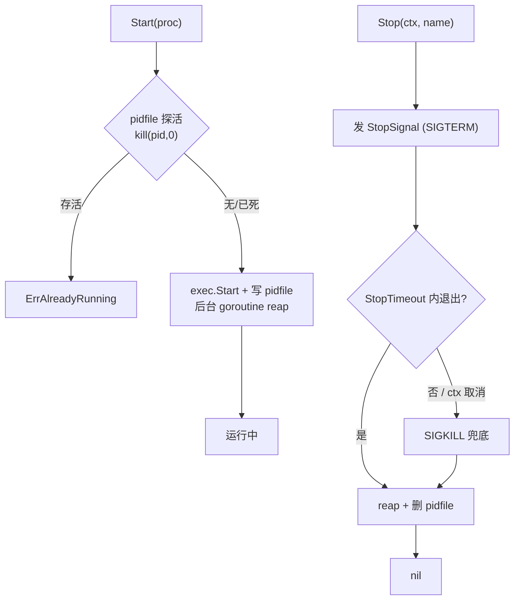

# supervisor

开发环境友好的进程管理库：以代码 API 定义进程，启动即落 pidfile，
停止时先发优雅信号、超时 SIGKILL 兜底。

**定位澄清**：这是"库"，不是常驻守护进程（不是 supervisord 的替代品）。
它管的是"我用代码拉起的子进程"，不做自动拉活、不做跨机管理。

## 特性

- **Start（创建）**：`exec.Command` 拉起 + 独立 goroutine reap（无僵尸）+
  启动即写 pidfile；存活实例拒绝重复启动（`ErrAlreadyRunning`）
- **Stop（优雅停止）**：SIGTERM（可配）→ 等 `StopTimeout`（默认 10s）→
  SIGKILL 兜底 → reap + 删 pidfile；幂等（重复 Stop / 已死进程均 nil）
- **孤儿接管**：父进程重启后，新 Manager 凭 pidfile + `kill(pid,0)` 探活
  接管停止（轮询等待，无 Wait 句柄）
- **Restart / Status / List**：退出码记录（`ExitCode`），`List` 同时覆盖
  内存实例与 pidfile 目录
- **进程名校验**：拒绝路径分隔符与 `..`，pidfile 布局不可被构造名字破坏
- **并发安全**：单锁保护实例表，`-race` 全绿

## 流程



## 安装

```bash
go get github.com/zavierswong/go-infra/supervisor
```

## 快速开始

```go
m := supervisor.New(supervisor.Config{
	PidDir: os.TempDir(),     // 缺省 os.TempDir()/go-infra-supervisor
	Logger: logger.Default(),
})

proc := supervisor.Process{
	Name:    "local-api",
	Command: "/usr/local/bin/api-server",
	Args:    []string{"--port", "8080"},
	Stdout:  os.Stdout, // 调试时透传输出；缺省丢弃
	Stderr:  os.Stderr,
}

pid, err := m.Start(proc)        // ErrAlreadyRunning 表示旧实例还在
ctx, cancel := context.WithTimeout(context.Background(), 15*time.Second)
defer cancel()
err = m.Stop(ctx, "local-api")   // SIGTERM → 10s → SIGKILL → 删 pidfile
_ = m.Restart(ctx, "local-api")  // Stop + 用原定义 Start
st, _ := m.Status("local-api")   // {Name, Pid, Running, ExitCode}
```

## 配置参考

### Config

| 字段 | 类型 | 默认值 | 说明 |
|---|---|---|---|
| `PidDir` | `string` | `os.TempDir()/go-infra-supervisor` | pidfile 目录，自动创建 |
| `Logger` | `*slog.Logger` | `slog.Default()` | 生命周期日志；推荐 `logger.Default()` |

### Process

| 字段 | 类型 | 默认值 | 说明 |
|---|---|---|---|
| `Name` | `string` | 必填 | 唯一标识 = pidfile 名；禁 `/` `\` `..` |
| `Command` | `string` | 必填 | 可执行文件 |
| `Args` | `[]string` | `nil` | 参数 |
| `Dir` | `string` | 继承父进程 | 工作目录 |
| `Env` | `[]string` | 继承父进程 | **完整替换**（os/exec 语义，非增量） |
| `Stdout` / `Stderr` | `io.Writer` | 丢弃 | 调试可传 `os.Stdout` |
| `StopSignal` | `os.Signal` | SIGTERM | 优雅停止信号 |
| `StopTimeout` | `time.Duration` | `10s` | 超时后 SIGKILL |

### API

| 符号 | 说明 |
|---|---|
| `New(Config) *Manager` | 构造 |
| `Start(Process) (pid int, error)` | 拉起 + pidfile；`ErrAlreadyRunning` / `ErrInvalidName` |
| `Stop(ctx, name) error` | 优雅停止；幂等；`ErrNotRunning` |
| `Restart(ctx, name) error` | Stop + 原定义 Start |
| `Status(name) (Status, error)` | 单进程状态；`ErrNotRunning` |
| `List() []Status` | 内存 + pidfile 目录全部进程 |

## 与 shutdown 包的配合

被管进程内部用 [`shutdown`](../shutdown/) 收 SIGTERM 走清理钩子，
supervisor 只负责发信号与超时强杀——两边是互补关系：

```
supervisor.Stop ── SIGTERM ──> 被管进程 (shutdown.Run 收口)
        │                            │ 逆序清理钩子
        └── StopTimeout 超时 ── SIGKILL 兜底
```

## 注意事项

- **Unix-only**：信号控制依赖 `syscall.Kill`；Windows 下 SIGTERM 无意义，
  本包不做支持（编译不挡，运行时行为不保证）。
- **pid 复用风险**：pidfile 探活是 `kill(pid,0)`，理论上 pid 被无关进程
  复用会误判存活。开发环境 pid 空间大、复用窗口短，可接受；生产编排
  请用容器/systemd。
- **Stdout/Stderr 传入的 Writer 必须有人持续读**：`exec.Cmd.Wait` 会等待
  输出拷贝协程结束，塞一个无人读的同步管道（如 `io.Pipe` 写端）会让
  Wait 永不返回，Stop 误判超时。开发调试传 `os.Stdout` 最稳。
- **Env 是完整替换**：要继承父进程请显式传 `os.Environ()` 再追加。
- **不做自动拉活**：开发环境要的是确定性；需要自愈时在调用层包一个
  重启循环（配合 `Status`），或换 systemd。
- **Stop 的 ctx**：ctx 取消/超时会立即触发 SIGKILL 兜底，不会无限等。

## 测试

```bash
go test ./supervisor/ -race -count=1
```

测试用"测试二进制自重入"模式模拟被管进程（helper 收 SIGTERM 退出 /
忽略 SIGTERM 等待强杀 / 以 1 退出），就绪握手用文件标记轮询。
覆盖：优雅停止全流程、幂等停止、重复启动拒绝、Restart 换 pid、
SIGKILL 兜底、孤儿接管、List、非法名、非零退出码、并发启停。

## 目录结构

```
supervisor/
├── supervisor.go      # Manager / Start / Stop / Restart / Status
├── supervisor_test.go # 10 个用例（helper process 模式）
└── example_test.go    # 可编译示例
```
