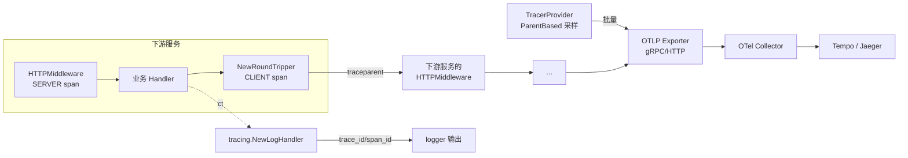

# tracing

基于 OpenTelemetry 的分布式链路追踪支持。是本仓库**唯一** import otel 的地方 ——
`access/*`、`logger`、`metrics` 契约包保持零观测依赖，与 `prometheus/` 适配包同一分层铁律。

## 简介

此前仓库的可观测性只有两块：Prometheus 指标（`metrics/` 契约 + `prometheus/` 适配），
以及日志里手工传递的单个 `trace_id`（`logger.WithTraceID`）。它们回答不了跨服务的问题：
一次请求经过网关 → 订单服务 → 支付服务 → MySQL/Redis/MQ，每段耗时多少、断在哪一跳？

`tracing/` 补上这一层：

- **W3C 标准传播**：`traceparent` / `baggage` 跨服务透传，与所有 otel 生态（nginx、
  Envoy、其他语言的 SDK）互通；
- **日志自动关联**：包装 slog Handler 后，span 存在时所有日志自动携带
  `trace_id` / `span_id`，不再依赖手工注入；
- **HTTP 进出口开箱即用**：服务端中间件 + 客户端 RoundTripper，span 的父子关系
  由传播器自动缝合；
- **OTLP 上报**：经 Collector 转发 Tempo / Jaeger 等任意后端。

## 特性

| 能力 | 说明 |
|---|---|
| OTLP 导出 | gRPC（:4317）/ HTTP（:4318）二选一，支持自定义 header 鉴权 |
| 采样 | `ParentBased(TraceIDRatioBased)`：根 span 按比例，上游已采样则全链路跟随 |
| HTTP 服务端 | `HTTPMiddleware`：提取上游 → 建 SERVER span → 记录状态码，panic 原样透传 |
| HTTP 客户端 | `NewRoundTripper`：建 CLIENT span → 注入出站 traceparent，不污染请求对象 |
| MQ 传播 | `InjectMap` / `ExtractMap` 适配任意 string→string 载体（amqp Table / kafka Headers） |
| 日志桥 | `NewLogHandler`：slog Handler 装饰器，自动注入 trace 字段 |
| 零侵入兜底 | 未 `Init` 时全部 API 走 otel noop：零开销、不 panic、可先接线后上线 |

## 架构



## 安装

otel 依赖随本包自动引入，无需额外步骤：

```
go get github.com/zavierswong/go-infra/tracing
```

## 快速开始

```go
package main

import (
    "context"
    "net/http"

    infratrace "github.com/zavierswong/go-infra/tracing"
)

func main() {
    ctx := context.Background()

    // 1. 初始化（进程内一次），shutdown 注册进退出流程
    shutdown, err := infratrace.Init(ctx, infratrace.Config{
        ServiceName: "order-service",
        Endpoint:    "otel-collector:4317",
        Insecure:    true, // Collector 未挂 TLS 时必须
    })
    if err != nil {
        panic(err)
    }
    defer shutdown(context.Background())

    // 2. HTTP 进出口
    mux := http.NewServeMux()
    mux.HandleFunc("/orders", handleOrders)
    _ = http.ListenAndServe(":8080",
        infratrace.HTTPMiddleware("")(mux))

    // 3. 出站请求
    client := &http.Client{Transport: infratrace.NewRoundTripper(http.DefaultTransport)}
    _ = client
}
```

### 与 logger 包打通

```go
base := logger.Default().Handler()
handler := infratrace.NewLogHandler(base)
// 用 handler 重建全局 slog，或经 logger 的自定义入口替换。
// 效果：凡是在 span 内打的日志自动多两个字段：
// {"msg":"...","trace_id":"4bf92f35...","span_id":"00f067aa..."}
```

手工 `logger.WithTraceID` 与本机制**可共存**：记录上已存在 `trace_id`
字段时 Handler 不再追加（避免 JSON 重复键），手工值优先。

### MQ（RabbitMQ / Kafka）

`access/*` 按[分层铁律](#)不感知 otel，上下文搬运在业务侧用通用载体函数完成：

```go
// 生产：publish 前
carrier := map[string]string{}
infratrace.InjectMap(ctx, carrier)
headers := amqp.Table{}
for k, v := range carrier {
    headers[k] = v
}

// 消费：处理前
carrier := map[string]string{}
for k, v := range delivery.Headers {
    if s, ok := v.(string); ok {
        carrier[k] = s
    }
}
ctx = infratrace.ExtractMap(context.Background(), carrier)
ctx, span := tracer.Start(ctx, "consume order.created")
defer span.End()
```

## 配置参考

| 字段 | 类型 | 默认值 | 说明 |
|---|---|---|---|
| `ServiceName` | `string` | 必填 | 服务名，落 resource 的 `service.name`，后端按它聚合 |
| `ServiceVersion` | `string` | `""` | 服务版本，`service.version` |
| `Environment` | `string` | `""` | 部署环境，`deployment.environment.name` |
| `Endpoint` | `string` | SDK 默认 | OTLP 地址（Collector），如 `otel-collector:4317` |
| `Protocol` | `string` | `"grpc"` | `"grpc"` 或 `"http"`（对应 :4317 / :4318） |
| `Insecure` | `bool` | `false` | 明文上报；Collector 未挂 TLS 时必须为 true |
| `Headers` | `map[string]string` | `nil` | 附加到每条 OTLP 请求的 header（网关鉴权等） |
| `SamplingRatio` | `float64` | `1.0` | 采样比例 (0,1]；0 表示未设置；>1 归一化为 1 |
| `BatchTimeout` | `time.Duration` | `5s` | 批量导出最长等待间隔 |
| `ExportTimeout` | `time.Duration` | `30s` | 单次导出超时（gRPC 同时作为连接超时） |
| `MaxQueueSize` | `int` | `2048` | 导出队列长度，满则丢弃（不阻塞业务） |
| `MaxExportBatchSize` | `int` | `512` | 单批导出条数 |

## API 参考

| 符号 | 说明 |
|---|---|
| `Init(ctx, Config) (ShutdownFunc, error)` | 建 TracerProvider + 传播器并设为 otel 全局；返回刷新/停止函数 |
| `Tracer(name) trace.Tracer` | 取 Tracer（未 Init 时为 noop） |
| `SpanFromContext(ctx) trace.Span` | 取当前 span |
| `HTTPMiddleware(operation) func(http.Handler) http.Handler` | 服务端中间件；operation 为空时取 `r.Pattern` 路由模板 |
| `NewRoundTripper(base) http.RoundTripper` | 客户端 Transport 装饰器；base 为 nil 用 `http.DefaultTransport` |
| `InjectHeaders / ExtractHeaders` | `http.Header` 载体注入/提取 |
| `InjectMap / ExtractMap` | `map[string]string` 载体注入/提取（MQ 用） |
| `NewLogHandler(h slog.Handler) slog.Handler` | 日志自动注入 trace_id/span_id 的包装器 |

## 注意事项（含已知缺陷）

1. **shutdown 必须调用**。批量处理器里未满批的 span 在进程退出时会丢；
   `Init` 返回值请注册进 `shutdown/` 钩子链。刷新超时只丢尾部 span，不视为致命错误。
2. **span 名基数**。`HTTPMiddleware("")` 在无 `r.Pattern` 时退化为
   `METHOD /path`，`/user/123` 这类路径会把 span 名刷成高基数。
   动态路径要么用 ServeMux 模板路由，要么显式传 operation。
3. **4xx 语义**。服务端 span 对 4xx 不置 Error（是客户端的错）；
   客户端 span 对 4xx/5xx 都置 Error（对方回了错误响应）。
   这是 OTel HTTP 语义约定，与直觉的"4xx 也是我的错"不同。
4. **`access/*` 不产生 span**。数据库/Redis/MQ 的操作观测仍走
   `metrics.Event` 事件流（Observer 契约），本包不把事件翻译成 span ——
   扁平事件没有父子上文，硬转会造出孤儿 span。如需 DB span，
   在业务侧用 gorm 的 otel 插件（由应用决定是否引入）。
5. **重复 `Init` 会覆盖全局**，且旧 provider 的 shutdown 句柄随之丢失
   （后台导出协程无法停止）。请按"进程内一次"使用。
6. **`Resource.Merge` 的默认 service.name**。`resource.Default()` 自带
   `unknown_service:<exe>`，本包的自定义属性会覆盖它，但若你的 Collector
   端做 service.name 白名单，记得核对。
7. **baggage 会被各传播器端到端透传**，不要往里塞大对象或敏感信息
   （header 空间有限，且每跳可见）。

## 日志

本包自身不打日志（观测组件保持静默）。span 级别的事件（异常、panic）
直接进 span 的 `RecordError` 事件流，由后端展示。

## 测试

```
go test ./tracing/ -race -count=1
```

- 9 个用例全部基于内存 exporter（`SimpleSpanProcessor`），无网络依赖；
- OTLP 上报本身不在此覆盖范围（需要 Collector），见上文注意事项第 1 条；
- `example_test.go` 为可编译示例（不带 `// Output:`，只编译不执行）。

## 目录结构

```
tracing/
├── tracing.go      # Init / ShutdownFunc / Tracer / SpanFromContext
├── config.go       # Config + ready()（validate→normalize 两阶段）
├── propagation.go  # http.Header / map 通用载体注入与提取
├── http.go         # HTTPMiddleware / NewRoundTripper
├── handler.go      # NewLogHandler（slog 装饰器）
├── tracing_test.go # 9 用例（内存 exporter，-race）
├── example_test.go # 可编译示例
└── README.md
```
